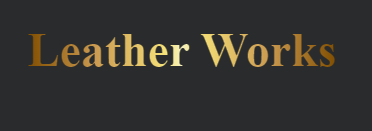

# **Leather Works**

[Live Website](https://leather-works.herokuapp.com/) 
[GitHub Repo](https://github.com/LauraMayock/Leather-works-sustainable-products)

## Business Background

 

Leather works is a small company making and selling leather products from sustainably sourced leather. With consumers being more mindful than ever, we aim to provide high-quality, environmentally friendly, and ethically sourced products that will last a lifetime. 

 

## **Table of Contents**

* [**Planning Phase**](#planning-phase)
  * [**User Experience**](#user-experience)
    * [***Site Aims***](#site-aims)
    * [***Opportunities***](#opportunities)
    * [***Scope***](#scope)
    * [**Agile Methodology:**](#agile-methodology)
      * [**User Stories:**](#user-stories)
        * [**EPIC 1 - Set up and Deployment:**](#epic-1---set-up-and-deployment)
        * [**EPIC 2 - Viewing and Navigation:**](#epic-2---viewing-and-navigation)
        * [**EPIC 3 - Registration and User Accounts:**](#epic-3---registration-and-user-accounts)
        * [**EPIC 4 - Sorting and Searching:**](#epic-4---sorting-and-searching)
    * [**Wireframes:**](#wireframes)
      * [***Home Page:***](#home-page)
      * [***Products Page:***](#products-page)
      * [***Product Details Page:***](#product-details-page)
      * [**Database Schema:**](#database-schema)
    * [**SEO considerations**](#seo-considerations)
      * [***Keywords***](#keywords)
      * [***Page Titles***](#page-titles)
      * [***Robots.txt and sitemap.xml***](#robotstxt-and-sitemapxml)
    * [***Content***](#content)
    * [**Surface**](#surface)
      * [***Colour Scheme***](#colour-scheme)
      * [***Typography***](#typography)
  * [**Agile Development Process**](#agile-development-process)
  * [**E-commerce Application Type**](#e-commerce-application-type)
  * [**Marketing Stratergy**](#marketing-stratergy)
* [**Features**](#features)
  * [**Common to All Pages**](#common-to-all-pages)
    * [**Navbar**](#navbar)
      * [**Overall Appearance**](#overall-appearance)
        * [***Desktop***](#desktop)
        * [***Mobile***](#mobile)
      * [**Common Navbar Features for both Desktop and Mobile**](#common-navbar-features-for-both-desktop-and-mobile)
        * [***Logo***](#logo)
          * [***Desktop***](#desktop-1)
          * [***Mobile***](#mobile-1)
        * [***Search Bar***](#search-bar)
          * [***Desktop***](#desktop-2)
          * [***Mobile***](#mobile-2)
      * [**Account menu**](#account-menu)
        * [***Unauthenticated***](#unauthenticated)
        * [***Authenticated***](#authenticated)
      * [**Cart icon**](#cart-icon)
    * [**Footer**](#footer)
      * [***Desktop***](#desktop-3)
      * [***Mobile***](#mobile-3)
      * [**Common Features to both Desktop and Mobile**](#common-features-to-both-desktop-and-mobile)
        * [***Social Media Links***](#social-media-links)
        * [***Newsletter Sign Up***](#newsletter-sign-up)
        * [***Sitemap***](#sitemap)
    * [**Notifications**](#notifications)
  * [**Page content**](#page-content)
    * [**Home Page**](#home-page-1)
    * [**Products Page**](#products-page-1)
    * [**Product Details Page**](#product-details-page-1)
    * [**Reviews**](#reviews)
      * [***Unauthenticated***](#unauthenticated-1)
      * [***Authenticated***](#authenticated-1)
    * [**Edit product - frontend form**](#edit-product---frontend-form)
    * [**Shopping Cart**](#shopping-cart)
      * [***Desktop***](#desktop-4)
      * [***Mobile***](#mobile-4)
    * [**Checkout**](#checkout)
      * [***Desktop***](#desktop-5)
      * [***Mobile***](#mobile-5)
    * [**Checkout Success**](#checkout-success)
    * [**Profile**](#profile)
    * [***Contact us***](#contact-us)
    * [**Authentication**](#authentication)
    * [***Stock management system***](#stock-management-system)
    * [**Age verification pop-up**](#age-verification-pop-up)
    * [**Responsive Design**](#responsive-design)
  * [**Admin Panel for Shop Administration**](#admin-panel-for-shop-administration)
    * [**Admin Panel Overview**](#admin-panel-overview)
      * [***Products***](#products)
      * [**Messages**](#messages)
      * [**Orders**](#orders)
    * [**Future Features**](#future-features)
      * [***Automation of the stock system***](#automation-of-the-stock-system)
      * [***Dynamically add nav links for new categories/subcategories***](#dynamically-add-nav-links-for-new-categoriessubcategories)
      * [***Sales reports***](#sales-reports)
      * [***Additional shipping choices***](#additional-shipping-choices)
      * [***Additional payment methods***](#additional-payment-methods)
      * [***Additional user account features***](#additional-user-account-features)
      * [***Product options***](#product-options)
      * [***Ticketing Sytem***](#ticketing-sytem)
  * [**Testing Phase**](#testing-phase)
  * [**Deployment**](#deployment)
  * [**Technologies used**](#technologies-used)
  * [**Honorable Mentions**](#honorable-mentions)
  * [**Credits**](#credits)
    * [**Media**](#media)

# **Planning Phase**

## **User Experience (UX)**

### ***Site Aims***
Our new website aims to expand our market base and provide easily accessible information on what our company stands for and the lengths our company goes to offer a sustainable product that can be enjoyed for a lifetime. 

We hope to:

* Expand our product base to a larger market, expanding nationally and worldwide. With the ability to buy online and have it shipped.

* Provide information and grow trust in our company and how we aim for sustainability within the vast number of people already conscious about sustainability.

* Provide information and grow support from people who are not explicitly looking for a sustainable leather product but would like to support an Irish, family-run business.

### ***Scope***

To clearly understand the business owner's requests and requirements for this project. I have used the MoSCoW method to divide the above opportunities into the below categories aiding me to prioritize and ensure that I can achieve my goal of a fully functioning MVP by the deadline. In following the Agile methodology progress will be reviewd on a regular basis : -

* To create a minimum functional E-commerce site, The below **must** be prioritiesed :

  * Full CRUD Functionality.
  * User login/register.
  * Checkout system.
  * Account profile.
  * Mailing list.
  * Product Filters/searching.
  * Stripe payments.
  * SEO language throughout.
  * Guest checkout completion.
  * User Role permissions.
  * Order History.
  * Social Media page.
  * Password Recovery.
  * Email confirmation of order.
  * User feedback for actions taken.
  * Saved customer details on checkout.

* To enhance user experience and increase site functionality, the below **should** be addressed:

  * Product reviews. 
  * Contact form.
  * Admin can add/remove products via the front end.
  * Delivery information.
  * FAQ
  * Terms and conditions.

* To increase the sites popularity and customer base, it would be  **nice to have** the below opportunities addressed : -

  * Blog.
  * Video demo of products.
  * Ability to edit order until status set to processing.
  * Stock management system.
  * Order Status.

### ***Agile Methodology***

The Agile Methodology was used to plan this project. This was implemented through Github and the Project Board, which can be seen here - (Leather Works)[https://github.com/users/LauraMayock/projects/7]

Through the use of the Kanban board in the projects view in Github, the project was divided into a few different sections:

* Backlog
* Current Iteration
* In Progress
* Done

(Image of Kanban)[media/kanban-board.png]

Github issues were used to create User Stories and any other Fixes or Updates for the project. This is where the project user was assigned; labels were added to show at a glance importance of tasks and help prioritize jobs. User story was added to the appropriate Iteration and the project. Each User Story, Fix or Update had a clear title, acceptance criteria and smaller tasks (if applicable).

Milestones were used to create Iterations. There were 3 Iterations, each dated appropriately. User Stories were completed based on the current Iteration that was in progress.

#### **User Stories:**

##### **1st Iteration:**

  As a **Shopper** I am able to...
  * ...**view a list of products** so that I can **select some to purchase.**
  * ...**view individual products in detail** so that I can **make a more informed decision**
  * ...**sort site items** so that I can **easily identify the best price/ product.**
  * ...**search items using a search bar** so that I can **easily search for a specific item and how many items fall under that search name**
  * ...**easily register with the site** so that I can **have a personal account and profile**
  * ...**As a shopper I am able to login/logout** so that I can **easily access my preexisting account**
  * ...**view the footer** so that I can **access all relevant information in a click of a button**

##### **2ed Iteration:**

* As a **Shopper** I want to be able to...
  * ...**sort items by categories** so that I can **find the product I am looking for quickly or view all products that are alike on the same page** 
  * ...**clearly see the colors available for each product** so that I can **easily choose the correct color.**
  * ...**I am able to recover a lost password** so that I can **recover access to my account/profile**
  * ...**amend and view my profile** so that I can **view orders history and confirmation and save my payment infromation**
  * ...**view items In my basket** so that I can **view my chosen products as well as the total cost**
  * ...**pay for items in a secure way** so that I can **confidently shop knowing that my personal/banking/card information is safe**
  * ...**receive a confirmation email** so that I can **be assured the transaction was processed and have a record of the purchase.**

As a **store owner** I am able to 
  * ...**add a product to the database** so that I can add **new items to the store**
  * ...**edit/update product information** so that I can **ensure my store has the correct description, price, images on each product**
  * ...**delete a product** so that I can **remove items that are now longer for sale**

##### **3ed Interation:**

* As a **Shopper** I want to be able to...
  * ...**easily view the total of my purchase easily** so that I can **ensure that I am happy with my chosen item and so I dont spend over my budget**
  * ...**easily see the purpose of the site from the landing page** so that I can **see if the site is relevant to my needs**
  * ...**As a user I have easy accessible information that is relevant to me** sot that i can **make an informed decision on the shop I choose to buy from and the products I purchase**
  * ...**keep upto date with leather works on their social media accounts** so that I can be **first to hear about new products and deals**
  * ...**As a user I am able to suscribe to a newsletter** so that I can be **upto date on latest product releases and deals**

##### **4th Interation:**

* As a **Site User** I want to be able to...
  * ...**Register for an account** so that I can **save my personal details, view my order history online.**

### ***Opportunities***

In the course of providing a fully functioning E-commerce platform, the following opportunities are available: -

Opportunity | Importance | Viability/Feasibility
---|---|---
Mailing list | 5 | 5
Account profile | 5 | 5
Product Filters/searching | 5 | 5
SEO language throughout | 5 | 5
stripe payments | 5 | 5
User feedback for actions taken | 5 | 5
Check out system | 5 | 5
Guest checkout completion | 5 | 5
User login/register | 5 | 5 |
Blog | 1 | 5
Video demo of products | 1 | 5
Delivery information | 3 | 5
Product reviews | 5 | 3
Full CRUD functionality | 5 | 5
Order History | 5 | 5
Information on sustainable leather | 1| 5
Stock management system | 5 | 3 |
Contact form | 3 | 5
Social Media pages | 5 | 5
Special offers | 5 | 5
Password Recovery | 5 | 5
Email confirmation of order | 5 | 5
Saved customer details on checkout | 5 | 5
Admin can add/remove products via the front end | 3 | 5
Multiple currencies | 5 | 1
Terms and conditions | 3 | 5
FAQ | 3 | 5
Generate sales reports | 5 | 1
Order Status | 2 | 5
Ability to edit order until status set to processing | 1 | 5
---------------------- | --- | ---  
Totals | 129 | 138

#### **Wireframes:**

Wireframes were created using Balsamiq wireframes to visualize how the site would look and function. Included below are the wireframes used to plan the site's layout. However, some changes/omissions were made during the development process due to time or practicality.

##### ***Home Page:***

[Home page wireframe](media/Mobile%20%26%20Desktop.png)

##### ***Products Page:***

[Products page wireframe](media/Mobile%20%26%20Desktop-product%20page.png)

##### ***Product Details Page:***

[Product details page wireframe](media/Mobile%20%26%20Desktop-product_detail_page.png)

#### **Database Schema:**

The database table scheme was created using [drawsql.app](https://drawsql.app) and can be seen below.

[Database wireframe](media/database.png)

### **Web Marketing Strategy**

The primary aim is to optimise search engine ranking and in turn increase traffic to the website.

### **Search Engine Optimisation (SEO)
SEO research is key to driving traffic from a browser based search i.e. Google to the website. The keyword research has played a crucial role in incorporating words that users typical search for when seeking to purchase Leather products online. To help improve the search engine ranking I ensured each web page has it's own title, and the site carries meta tags for a description and keywords which encapsulate the general content and focus of this B2C site.

#### ***Keywords***

I performed keyword research to understand what topics and categories users search for when shopping for sustainable leather-related products online. First, I brainstormed general topics to ascertain some keywords and followed this by researching these words using google to understand potential short-tail and long-tail keywords. Using wordtracker.com, I evaluated which would be competitive, relevant, authoritative and trustworthy.

Short-tail Keywords

Sustainable leather
leather products
leather bags
leather wallets
leather belts
sustainable products
Irish leather
Irish Tanner
Irish products
Gifts
Irish gifts
luxury gifts
sustainablity

Long-tail Keywords

Is leather sustainable
Irish leather products
supporting Irish companies

**Related searches provided by google**
  * Sustainable leather foundation
  * Sustainable leather brands
  * Ethically sourced leather
  * sustainable leather alternatives
  * purluxe leather alternatives

**People also asked**
  * Why is sustainable leather so important?
  * What is the most eco-friendly vegan leather?
  * What is the sustainable leather foundation's transparency dashboard?
  * What do customers want from the leather industry?

I used (ryrob.com)[https://www.ryrob.com/keyword-tool/] to help find the best keywords to use. Unfortunately, it provided no information when I clicked Ireland or the United Kingdom as regions. There was no Europe option, so I decided to go with the United States for its large demographic.

Search using "Homemade sustainable leather products."
[Keyword research](media/keyword%20search%201.png)
[Keyword research](media/keyword%20search%202.png)

The volume column in the above images shows the estimated google monthly volume using those keywords. 

The Difficulty column grades each keyphrase on how difficult it would be to rank on the first page of google.

This website also could view related searches based on the keyword.
As the list was extensive, I will highlight below the ones I thought maybe best targeted, taking into account the volume of searches per month and how difficult it would be to reach the coveted first page on google search.

A lot of the tail words provided were based on destinations. The fact that the company ships worldwide will hopefull pick up these searches. But I will not be prioritising worldwide shipping as it is too commom a keyword. Instead, I will use the fact the company is Irish.

**leather goods store**
Volume 22.2k
Difficulty medium

* leather goods store near me
* leather goods stores nearby
* leather goods for sale
* leather bags store near me
* leather bags shop near me

**Handmade.leather bags**
volume 1.3k
Difficulty medium

* handmade leather bags
* handmade leather bags near me
* custom leather goods
* handmade leather purses for sale

**Sustainable bags**
Volume 720
Difficulty medium

* sustainable bags brands
* sustainable bags meaning

**Ethical leather bags**
Volume 110
difficulty medium

* ethical leather bags
* ethical bag companies

This website also had a blog title generator to help with SEO. Here are a few options that we will concentrate on for blog posts and facebook post titles.

**Blog post titles**
* 5 Reasons to Buy Handmade Leather Bags
* The Benefits of Investing in Quality
* How to Choose the Perfect
* A Guide to Caring for Your

* The Ethical Choice: Understanding the Benefits of Sustainable Leather Goods
* Exploring the Pros and Cons of Sustainable Leather
* The Eco-Friendly Fabric: How Sustainable Leather Production Can Help the Environment
* Sustainable Leather: Reducing the Carbon Footprint of the Fashion Industry
* What is sustainable leather?

### ***Content***

The ecommerce site itself did not have many opportunities for content in terms of paragraphs and text. A lot of the keywords are products themselves, so I have tried to leverage the use of heading tags and image names so that the quality of my site's search rating is as high as possible. I also created a blog linked to the website in various areas. This has helped my optimise keywords, tailwords as well as optimal blog names that would help with SEO. I also added a FAQ page to provide extra information to the customer as well as links to outside sources.

### XML Sitemap and Robots.txt file

Additionally to help the search engines crawl the website, I've added an XML sitemap file to the main root directory. The file was created using the free service through [XML-Sitemaps.com](https://www.xml-sitemaps.com/). A sitemap is a way of organizing a website, identifying the URLs and the data under each section. Previously, the sitemaps were primarily geared for the users of the website. However, Google's XML format was designed for the search engines, allowing them to find the data faster and more efficiently. 

I also created a robots.txt file but have not added any restrictions.

A robots.txt file has also be included in the build to tell the search engine crawlers which URLs the crawler can access on this site. This is used mainly to avoid overloading the site with requests.

### MailChimp Newsletter

To allow the business to communicate with their customers to promote products and events through digital marketing, I've partnered with MailChimp. This is initially a free service with MailChimp to collect customers email addresses. The business can then construct the newsletter using MailChimp's online service. The feature is located on the Homepage, offering an opportunity for customers to enter their address to subscribe. Once the email address is submitted a success message is presented to thank them for signing up.

    
<b>MailChimp</b>

    

      
    

 

### Facebook Page

To further increase traffic to the website, a Facebook page has been created that will display information about the products and family run business.

Facebook header

Facebook main page 

Facebook Post 

Facebook Post 

 

#### ***Colour Scheme***

Black and white feature heavily throughout the site. However, I added color to help the content pop and to help with the branding. I chose gold, white and a dark grey.

[Color Pallet](media/color%20pallet.png)
  

* The logo was origionally created on [looka.com](https://looka.com/) I have used the logo on the main carousel. This ensures that when viewed on small screens, the branding is still visible even when the primary logo on the navbar disappears.

 
  I based the rest of the color theme around this. Main Logo I got the gold effect for the navbar logo from [Codingartistweb](https://codingartistweb.com/)

* I found another variation of the gold effect on codepen that I used to create a gold horrizontal line [Codepen](https://codepen.io/chilliconcode/pen/OWxqYR)

#### ***Typography***

For this project, I have used the following fonts:

* [DM Sans](https://fonts.google.com/specimen/DM+Sans?query=dm+s) - This font is used for the main headings and the logo. It is a clean and simple font that is easy to read and stands out well.
* [Damion](https://fonts.google.com/specimen/Damion?query=damion) - This was for the logo. I initially wanted to make the V and the T cursive; however, I found this font perfect for all letters of the logo.

# **Features**

### **Navbar**

The navigation bar is the core navigation for the site. It differs slightly from mobile to desktop; however, both include all the same components.

##### ***Desktop***

##### ***Mobile***

##### ***Logo***

The logo on the navbar was created using HTML and CSS (including bootstrap classes). It was based on the logo hero image used in the image carousel.

The size of the logo can also be used as a link to the home page. On mobile, the Logo is replaced with a hamburger menu for ease of use when navigating on smaller screens.

##### ***Search Bar***

The search bar is accessible by clicking on the universally recognisable search icon. This opens the input bar that allowes the user enter their search term, and the products page will return any products that match the search term. This function checks the product name and description; the search term is retained and displayed to the user next to the number of results displayed.

#### **Product menu tab**

The Product button is a dropdown button that provides the user access to each of the product categories available to them. Once a product category is chosen, the user will be brought to a page displaying the product category and the number of items in that class.

#### **Blog menu**

The Blog button shows a dropdown nav link which shows a link access to the blog or if you are a superuser you also have access to a Create Post link.

#### **Account menu**

The account menu is a drop-down menu that appears when the user clicks on the account icon. The drop-down changes slightly depending on the authentication status of the user. The menu will show the option to log in or register if the user is not logged in. If the user is logged in, the menu will allow them to log out and go to their account, where they can amend the default shipping address and review their order history.

##### ***Unauthenticated***

##### ***Superuser access***

#### **Basket icon**

The Basket icon is visible in the navbar on all pages. The icon indicates the current total of all the items in the basket and how many things make up this total.

A cart preview appears when the user adds an item to the cart. This cart preview relays the success message, gives a scrollable preview of the cart, the current total excluding delivery, and an informative message about how far the user is from the free delivery qualifier.

Clicking the cart icon any time will take the user to the shopping basket page described later.

### **Footer**

#### ***Desktop***

#### ***Mobile***

The footer is present on all pages. It contains four main sections.

The three sections typical to both desktop and mobile are:

* Company Links
    * About Us - Linking to relevant Blog post 
    * Sustainability - Linking to relevent blog post
    * Certificates - Linking to relevent blog post

* Get Help Links
    * FAQ - Linking to FAQ page
    * Contact us - Linking to contact us page

* Shop
    * All Products
    * Customer orders - Linking to relevant blog post

* Social media links
    * Facebook 
    * Linked in 
    * Instagram
    * Twitter

I have included only one social media link for Facebook for the purposes of this project as it is the one I would like most to leverage in my marketing strategy. However, should this project ever grow further, it would also be expected to include Twitter and Instagram as a minimum.

The current Facebook link will take the user directly to [Facebook](https://www.facebook.com/profile.php?id=10009067842726), where the shop will share promotions and news about the latest product drops as well as promote sustainable leather.

### **Notifications**

Similar to the cart preview, the notifications are a small pop-up appearing on the screen's top right. They are used to inform the user of the status of their actions. For example, if the user adds an item to the cart, they will see a notification that says, "Item added to cart." If the user tries to add an item to the cart that is out of stock, they will see a notification that says, "Item out of stock." Where ever possible, when the cart preview is not required, the notifications do not include it This was acheived by using django toast messages. 

These alerts are color-coded according to the default bootstrap colors/names below:

## **Page content**

### **Home Page**

The home page is the first page on which a user lands. For this reason, it has to have a clearly defined purpose and be easy to navigate. The page will also be used to promote the shop and its products.

To make the site's purpose immediately apparent, I included a carousel to view the two hero images that are both colorful, eye-catching and relevant to the theme. I also have two calls to action buttons one taking the user to the products page and one to the blog to learn more about sustainable leather and the company itself.

Below , I have included a brief into to the business and four cards highlighting four product categories. These demonstrate the site's purpose further and encourage the user to explore the site further.

Next is a section encouraging users to find out more about the unique products, its benefits and to find out more about the craftspeople themselves.

To solidify the trust and transparancy of the business I have added a carousel showing customer testimonials.

And finally, information on purchasing wholesale and an option to Subscribe.

### **Products Page**

The product page is where the user will browse the products and add them to the cart. It is also where users will go when they filter the products by category. The user can navigate between pages using the pagination buttons at the bottom of the page.

As well as a All products button, there is a dropdown button on the page for filtering products by category. The category chosen is highlighted on the top left of the screen under the drop down. Wherever the filter set the user chooses, they can sort by price, rating, and name.

On the individual product cards, the user can see the product name, price, image, and category. The user can  accessing the product details page by clicking on the product card. In the product details page the user can choose quantities and color options where available.

When logged in a super user will have access to and edit and delete button for each product card. This will allow for quick and easy update of the product range.

### **Product Details Page**

Users can access the product details page when they need more information before committing to purchase an item. This page contains all the information the user needs to make an informed decision. The page is divided into four sections:

* Product Images - The main image container updates when one of the smaller images are clicked on.
* Product Description - Name, Price, Rating, color if applicable, description and select quantity
* Customer reviews and leave a review section.

### **Reviews**

The reviews section was best suited to be on the product details page, making it easy to determine for which product the review was intended.

#### ***Unauthenticated***

The user can see all reviews when logged out; however, they cannot leave one. Above the accordion, they are prompted to log in or register to leave a review. The prompt also appears when there are no reviews, along with an invite to be the first to review the product.

#### ***Authenticated***

If a product has no review and the user is logged in, they will see an inline review form. 

Once the user submits the review, they are returned to the product details page of the product they were reviewing. A success alert will show and their review will be posted.

### **Add a product - frontend form**
This feature is enabled for super users only. Currently there is only one super user however the client may wish to add more as the inventory list increases. With this role based permission setting you can perform CRUD (Create, Review, Update and Delete) products from either the front or back end. The front end product management incorporates Bootstrap and Crispy to present clean forms to either Add, Edit or Delete a product. Super admins can review a product within the Product Details page - which when signed-in as a super user presents to links to either 'Edit' or 'Delete' and item. Otherwise this user type can add a product through the 'Account' drop-down nav menu, and selecting 'Add Products'. Below is an image of one of these screens, the ability to Update/Edit a product in the front end.

Once the product was added successfully and alert will show confirming this and the superuser will be redirected tho the product details page for the new product. They will have the option to view the product details as it will be viewed by the customer and edit or delete if required.

### **Edit product - frontend form**

As shown above, the product details page has an edit button for the super user to make a quick edit should they spot a typo or want to change a picture. This button takes the superuser to a form pre-populated with the current product information. The user can then make the changes they require and submit the form. The form is validated on the front and back end, and the user is informed of any errors. The user is then redirected to the product details page.

### **Shopping Cart**

The shopping cart page is where the user can review the items for purchase, and there is a link that will skip the list of items and take the user directly to the totals at the bottom. The intention here is that if the user has a long list of items, they can quickly get to the checkout.

The user can also amend the quantity of each update and click the update button to update the cart. The user can also remove an item from the cart by clicking the remove button. The user cannot add more of a product than is currently in stock.

Once the user is happy with the items in the cart, they can click the secure checkout button to proceed to the checkout page.

The layout on this page changes slightly on mobile to improve the responsive nature. The quantity selector goes under the item on smaller screens. 
#### ***Desktop***

#### ***Mobile***

Lastly, users will see the following message displayed if they try to access the shopping cart with no items.

### **Checkout**

The checkout page is where the user will enter their payment details and shipping address. There is a chance to make one final review of the cart before proceeding to payment. The user can also go back to the cart to make any changes. If the user is logged in with details already saved to their profile from a previous order, then the form will be prefilled with this information.

The user can also save their details from the checkout page. However, this option is unchecked by default to prevent users from accidentally saving their details.

The card element is injected by the stripe API and uses a payment system that is fully PCI compliant. The same API also handles any errors using the allocated div to display them to the user. For a list of test card numbers, please see the [stripe documentation.](https://stripe.com/docs/testing).

When the form has been submitted, the pay now button converts into a spinner to show it is processing. Further to the spinner, there is a transparent overlay to prevent the user from clicking anything else and creating multiple orders.

The page is fully responsive, and the display order changes slightly from mobile to desktop.

#### ***Desktop***

#### ***Mobile***

Guests can also check out, and on the checkout page, they see the following in place of the save info checkbox.

If users are not logged in, there is no way to return to the checkout success page, as described below

The last stage of the check out if for the user to receive an email like the sample below:

### **Checkout Success**

### **Profile**

The profile page has a tab which is a form for the user to update their default shipping details

And another tab to view the order history in a scrollable table

The order number is truncated to save space, and when the user clicks on it, they are taken to a variation of the checkout success page. The only differences to the original checkout success page are the lack of a warning not to leave the page if not logged in and the button at the bottom, which takes the user back to the profile page.

### ***Contact us***

Finally, for the front end, I have created a simple contact form for the user to get in touch. I will discuss in detail shortly how this works from the point of view of replying. However, the form allows a platform for the user to send a message to the shop. The message will then be picked up from the admin panel and responded to via email, as is a standard convention.

### **Authentication**

The user can log in and out using an adapted version of templates from the all-auth library.

 

The user can reset their password via a form

Then receive an email with a link to reset their password on the store site.

  

Once changed, they will see the following message.

The user can also register for an account using the following form.

And will receive an email to verify their email, preventing spam accounts from being created.

The link in the email brings them to this screen

And once the email is confirmed, the user is invited to log in with their new account.

### ***Stock management system***

### **Responsive Design**

## **Admin Panel for Shop Administration**

### **Admin Panel Overview**

#### ***Products***

#### **Messages**

### **Future Features**

## **Testing Phase**

## **Deployment**

## **Technologies used**

* Python
  * The packages installed for the project can be found in [the requirements.txt](requirements.txt)
* Django
  * Django was used as the python framework in the project.
  * Django all auth was used to handle user authentication and related tasks i.e. sign in, sign up, sign out.
* Heroku
  * Used to deploy the page and make it publicly available.
* Heroku PostgreSQL & ElephantSQL
  * Used for the database during deployment.
* SQLlite3
	* Was used during development as a database to test models.
* HTML
  * HTML was the base language used to lay out the skeleton of all templates.
* CSS
  * Custom CSS is used to style the page and make the appearance look a little more unique.
* Javascript
  * I have used Javascript to manipulate the DOM and communicate with the backend to create, read, update, and delete data from the database.
* Bootstrap 4.6
  * Used to style HTML, CSS, minor javascript. The more I used this framework the most I realized retrospectively how it could have saved me writing several parts of the code I had already written.
* Font awesome
  * All icons throughout the page.
* AWS S3
  * Used to store static and media files.
* Stripe
  * Used to handle payments.

## **Credits**

* [Code Institute](https://codeinstitute.net/) - For the course material and the support throughout.  Some of the project may reflect similarities to the course material, but I have tried to make it as unique as possible.
* Balsamiq was used to create the wireframes.
* GitHub was used to store my repository.
* I lived in the [django documentation](https://docs.djangoproject.com/en/3.2/) and [Bootstrap](https://getbootstrap.com/docs/4.6/getting-started/introduction/) for the duration of the project live they were a bibles.
* [W3cschool](https://www.w3schools.com) used to remeber the syntax of various languages.
* [Stackoverflow](https://stackoverflow.com/) for debugging and finding solutions to problems.
* Fonts were taken from [Google Fonts](https://fonts.google.com/)
* [For help pushing the footer to the bottom of the page](https://www.youtube.com/watch?v=yc2olxLgKLk)
* [favicon generator](https://www.favicon-generator.org/) was used to generate the favicon.

