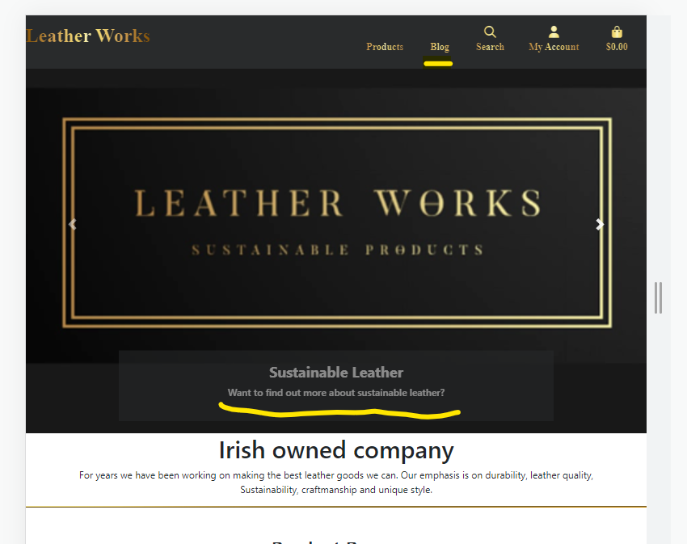

# **Leather Works**


[Live Website](https://leather-works.herokuapp.com/)<br>
[GitHub Repo](https://github.com/LauraMayock/Leather-works-sustainable-products)

## Business Background

<br>

Leather works is a small company making and selling leather products from sustainably sourced leather. With consumers being more mindful than ever, we aim to provide high-quality, environmentally friendly, and ethically sourced products that will last a lifetime. 

<br>

## **Table of Contents**

* [**Planning Phase**](#planning-phase)
  * [**User Experience**](#user-experience)
    * [***Site Aims***](#site-aims)
    * [***Opportunities***](#opportunities)
    * [***Scope***](#scope)
    * [**Agile Methodology:**](#agile-methodology)
      * [**User Stories:**](#user-stories)
        * [**EPIC 1 - Set up and Deployment:**](#epic-1---set-up-and-deployment)
        * [**EPIC 2 - Viewing and Navigation:**](#epic-2---viewing-and-navigation)
        * [**EPIC 3 - Registration and User Accounts:**](#epic-3---registration-and-user-accounts)
        * [**EPIC 4 - Sorting and Searching:**](#epic-4---sorting-and-searching)
    * [**Wireframes:**](#wireframes)
      * [***Home Page:***](#home-page)
      * [***Products Page:***](#products-page)
      * [***Product Details Page:***](#product-details-page)
      * [**Database Schema:**](#database-schema)
    * [**SEO considerations**](#seo-considerations)
      * [***Keywords***](#keywords)
      * [***Page Titles***](#page-titles)
      * [***Robots.txt and sitemap.xml***](#robotstxt-and-sitemapxml)
    * [***Content***](#content)
    * [**Surface**](#surface)
      * [***Colour Scheme***](#colour-scheme)
      * [***Typography***](#typography)
  * [**Agile Development Process**](#agile-development-process)
  * [**E-commerce Application Type**](#e-commerce-application-type)
  * [**Marketing Stratergy**](#marketing-stratergy)
* [**Features**](#features)
  * [**Common to All Pages**](#common-to-all-pages)
    * [**Navbar**](#navbar)
      * [**Overall Appearance**](#overall-appearance)
        * [***Desktop***](#desktop)
        * [***Mobile***](#mobile)
      * [**Common Navbar Features for both Desktop and Mobile**](#common-navbar-features-for-both-desktop-and-mobile)
        * [***Logo***](#logo)
          * [***Desktop***](#desktop-1)
          * [***Mobile***](#mobile-1)
        * [***Search Bar***](#search-bar)
          * [***Desktop***](#desktop-2)
          * [***Mobile***](#mobile-2)
      * [**Account menu**](#account-menu)
        * [***Unauthenticated***](#unauthenticated)
        * [***Authenticated***](#authenticated)
      * [**Cart icon**](#cart-icon)
    * [**Footer**](#footer)
      * [***Desktop***](#desktop-3)
      * [***Mobile***](#mobile-3)
      * [**Common Features to both Desktop and Mobile**](#common-features-to-both-desktop-and-mobile)
        * [***Social Media Links***](#social-media-links)
        * [***Newsletter Sign Up***](#newsletter-sign-up)
        * [***Sitemap***](#sitemap)
    * [**Notifications**](#notifications)
  * [**Page content**](#page-content)
    * [**Home Page**](#home-page-1)
    * [**Products Page**](#products-page-1)
    * [**Product Details Page**](#product-details-page-1)
    * [**Reviews**](#reviews)
      * [***Unauthenticated***](#unauthenticated-1)
      * [***Authenticated***](#authenticated-1)
    * [**Edit product - frontend form**](#edit-product---frontend-form)
    * [**Shopping Cart**](#shopping-cart)
      * [***Desktop***](#desktop-4)
      * [***Mobile***](#mobile-4)
    * [**Checkout**](#checkout)
      * [***Desktop***](#desktop-5)
      * [***Mobile***](#mobile-5)
    * [**Checkout Success**](#checkout-success)
    * [**Profile**](#profile)
    * [***Contact us***](#contact-us)
    * [**Authentication**](#authentication)
    * [***Stock management system***](#stock-management-system)
    * [**Age verification pop-up**](#age-verification-pop-up)
    * [**Responsive Design**](#responsive-design)
  * [**Admin Panel for Shop Administration**](#admin-panel-for-shop-administration)
    * [**Admin Panel Overview**](#admin-panel-overview)
      * [***Products***](#products)
      * [**Messages**](#messages)
      * [**Orders**](#orders)
    * [**Future Features**](#future-features)
      * [***Automation of the stock system***](#automation-of-the-stock-system)
      * [***Dynamically add nav links for new categories/subcategories***](#dynamically-add-nav-links-for-new-categoriessubcategories)
      * [***Sales reports***](#sales-reports)
      * [***Additional shipping choices***](#additional-shipping-choices)
      * [***Additional payment methods***](#additional-payment-methods)
      * [***Additional user account features***](#additional-user-account-features)
      * [***Product options***](#product-options)
      * [***Ticketing Sytem***](#ticketing-sytem)
  * [**Testing Phase**](#testing-phase)
  * [**Deployment**](#deployment)
  * [**Technologies used**](#technologies-used)
  * [**Honorable Mentions**](#honorable-mentions)
  * [**Credits**](#credits)
    * [**Media**](#media)


# **Planning Phase**

## **User Experience (UX)**

### ***Site Aims***
Our new website aims to expand our market base and provide easily accessible information on what our company stands for and the lengths our company goes to offer a sustainable product that can be enjoyed for a lifetime. 

We hope to:

* Expand our product base to a larger market, expanding nationally and worldwide. With the ability to buy online and have it shipped.

* Provide information and grow trust in our company and how we aim for sustainability within the vast number of people already conscious about sustainability.

* Provide information and grow support from people who are not explicitly looking for a sustainable leather product but would like to support an Irish, family-run business.

### ***Scope***

To clearly understand the business owner's requests and requirements for this project. I have used the MoSCoW method to divide the above opportunities into the below categories aiding me to prioritize and ensure that I can achieve my goal of a fully functioning MVP by the deadline. In following the Agile methodology progress will be reviewd on a regular basis : -

* To create a minimum functional E-commerce site, The below **must** be prioritiesed :

  * Full CRUD Functionality.
  * User login/register.
  * Checkout system.
  * Account profile.
  * Mailing list.
  * Product Filters/searching.
  * Stripe payments.
  * SEO language throughout.
  * Guest checkout completion.
  * User Role permissions.
  * Order History.
  * Social Media page.
  * Password Recovery.
  * Email confirmation of order.
  * User feedback for actions taken.
  * Saved customer details on checkout.

* To enhance user experience and increase site functionality, the below **should** be addressed:

  * Product reviews. 
  * Contact form.
  * Admin can add/remove products via the front end.
  * Delivery information.
  * FAQ
  * Terms and conditions.

* To increase the sites popularity and customer base, it would be  **nice to have** the below opportunities addressed : -

  * Blog.
  * Video demo of products.
  * Ability to edit order until status set to processing.
  * Stock management system.
  * Order Status.

### ***Agile Methodology***

The Agile Methodology was used to plan this project. This was implemented through Github and the Project Board, which can be seen here - (Leather Works)[https://github.com/users/LauraMayock/projects/7]

Through the use of the Kanban board in the projects view in Github, the project was divided into a few different sections:

* Backlog
* Current Iteration
* In Progress
* Done

(Image of Kanban)[media/kanban-board.png]

Github issues were used to create User Stories and any other Fixes or Updates for the project. This is where the project user was assigned; labels were added to show at a glance importance of tasks and help prioritize jobs. User story was added to the appropriate Iteration and the project. Each User Story, Fix or Update had a clear title, acceptance criteria and smaller tasks (if applicable).

Milestones were used to create Iterations. There were 3 Iterations, each dated appropriately. User Stories were completed based on the current Iteration that was in progress.

#### **User Stories:**

##### **1st Iteration:**

  As a **Shopper** I am able to...
  * ...**view a list of products** so that I can **select some to purchase.**
  * ...**view individual products in detail** so that I can **make a more informed decision**
  * ...**sort site items** so that I can **easily identify the best price/ product.**
  * ...**search items using a search bar** so that I can **easily search for a specific item and how many items fall under that search name**
  * ...**easily register with the site** so that I can **have a personal account and profile**
  * ...**As a shopper I am able to login/logout** so that I can **easily access my preexisting account**
  * ...**view the footer** so that I can **access all relevant information in a click of a button**


##### **2ed Iteration:**

* As a **Shopper** I want to be able to...
  * ...**sort items by categories** so that I can **find the product I am looking for quickly or view all products that are alike on the same page** 
  * ...**clearly see the colors available for each product** so that I can **easily choose the correct color.**
  * ...**I am able to recover a lost password** so that I can **recover access to my account/profile**
  * ...**amend and view my profile** so that I can **view orders history and confirmation and save my payment infromation**
  * ...**view items In my basket** so that I can **view my chosen products as well as the total cost**
  * ...**pay for items in a secure way** so that I can **confidently shop knowing that my personal/banking/card information is safe**
  * ...**receive a confirmation email** so that I can **be assured the transaction was processed and have a record of the purchase.**

As a **store owner** I am able to 
  * ...**add a product to the database** so that I can add **new items to the store**
  * ...**edit/update product information** so that I can **ensure my store has the correct description, price, images on each product**
  * ...**delete a product** so that I can **remove items that are now longer for sale**


##### **3ed Interation:**

* As a **Shopper** I want to be able to...
  * ...**easily view the total of my purchase easily** so that I can **ensure that I am happy with my chosen item and so I dont spend over my budget**
  * ...**easily see the purpose of the site from the landing page** so that I can **see if the site is relevant to my needs**
  * ...**As a user I have easy accessible information that is relevant to me** sot that i can **make an informed decision on the shop I choose to buy from and the products I purchase**
  * ...**keep upto date with leather works on their social media accounts** so that I can be **first to hear about new products and deals**
  * ...**As a user I am able to suscribe to a newsletter** so that I can be **upto date on latest product releases and deals**


##### **4th Interation:**

* As a **Site User** I want to be able to...
  * ...**Register for an account** so that I can **save my personal details, view my order history online.**


### ***Opportunities***

In the course of providing a fully functioning E-commerce platform, the following opportunities are available: -

Opportunity | Importance | Viability/Feasibility
---|---|---
Mailing list | 5 | 5
Account profile | 5 | 5
Product Filters/searching | 5 | 5
SEO language throughout | 5 | 5
stripe payments | 5 | 5
User feedback for actions taken | 5 | 5
Check out system | 5 | 5
Guest checkout completion | 5 | 5
User login/register | 5 | 5 |
Blog | 1 | 5
Video demo of products | 1 | 5
Delivery information | 3 | 5
Product reviews | 5 | 3
Full CRUD functionality | 5 | 5
Order History | 5 | 5
Information on sustainable leather | 1| 5
Stock management system | 5 | 3 |
Contact form | 3 | 5
Social Media pages | 5 | 5
Special offers | 5 | 5
Password Recovery | 5 | 5
Email confirmation of order | 5 | 5
Saved customer details on checkout | 5 | 5
Admin can add/remove products via the front end | 3 | 5
Multiple currencies | 5 | 1
Terms and conditions | 3 | 5
FAQ | 3 | 5
Generate sales reports | 5 | 1
Order Status | 2 | 5
Ability to edit order until status set to processing | 1 | 5
---------------------- | --- | ---  
Totals | 129 | 138

#### **Wireframes:**

Wireframes were created using Balsamiq wireframes to visualize how the site would look and function. Included below are the wireframes used to plan the site's layout. However, some changes/omissions were made during the development process due to time or practicality.

##### ***Home Page:***

[Home page wireframe](media/Mobile%20%26%20Desktop.png)

##### ***Products Page:***

[Products page wireframe](media/Mobile%20%26%20Desktop-product%20page.png)

##### ***Product Details Page:***

[Product details page wireframe](media/Mobile%20%26%20Desktop-product_detail_page.png)


#### **Database Schema:**

The database table scheme was created using [drawsql.app](https://drawsql.app) and can be seen below.

[Database wireframe](media/database.png)


### **Web Marketing Strategy**

The primary aim is to optimise search engine ranking and in turn increase traffic to the website.

### **Search Engine Optimisation (SEO)
SEO research is key to driving traffic from a browser based search i.e. Google to the website. The keyword research has played a crucial role in incorporating words that users typical search for when seeking to purchase Leather products online. To help improve the search engine ranking I ensured each web page has it's own title, and the site carries meta tags for a description and keywords which encapsulate the general content and focus of this B2C site.


#### ***Keywords***

I performed keyword research to understand what topics and categories users search for when shopping for sustainable leather-related products online. First, I brainstormed general topics to ascertain some keywords and followed this by researching these words using google to understand potential short-tail and long-tail keywords. Using wordtracker.com, I evaluated which would be competitive, relevant, authoritative and trustworthy.

Short-tail Keywords

Sustainable leather
leather products
leather bags
leather wallets
leather belts
sustainable products
Irish leather
Irish Tanner
Irish products
Gifts
Irish gifts
luxury gifts
sustainablity

Long-tail Keywords

Is leather sustainable
Irish leather products
supporting Irish companies

**Related searches provided by google**
  * Sustainable leather foundation
  * Sustainable leather brands
  * Ethically sourced leather
  * sustainable leather alternatives
  * purluxe leather alternatives

**People also asked**
  * Why is sustainable leather so important?
  * What is the most eco-friendly vegan leather?
  * What is the sustainable leather foundation's transparency dashboard?
  * What do customers want from the leather industry?

I used (ryrob.com)[https://www.ryrob.com/keyword-tool/] to help find the best keywords to use. Unfortunately, it provided no information when I clicked Ireland or the United Kingdom as regions. There was no Europe option, so I decided to go with the United States for its large demographic.

Search using "Homemade sustainable leather products."
[Keyword research](media/keyword%20search%201.png)
[Keyword research](media/keyword%20search%202.png)


The volume column in the above images shows the estimated google monthly volume using those keywords. 

The Difficulty column grades each keyphrase on how difficult it would be to rank on the first page of google.

This website also could view related searches based on the keyword.
As the list was extensive, I will highlight below the ones I thought maybe best targeted, taking into account the volume of searches per month and how difficult it would be to reach the coveted first page on google search.

A lot of the tail words provided were based on destinations. The fact that the company ships worldwide will hopefull pick up these searches. But I will not be prioritising worldwide shipping as it is too commom a keyword. Instead, I will use the fact the company is Irish.

**leather goods store**
Volume 22.2k
Difficulty medium

* leather goods store near me
* leather goods stores nearby
* leather goods for sale
* leather bags store near me
* leather bags shop near me

**Handmade.leather bags**
volume 1.3k
Difficulty medium

* handmade leather bags
* handmade leather bags near me
* custom leather goods
* handmade leather purses for sale

**Sustainable bags**
Volume 720
Difficulty medium

* sustainable bags brands
* sustainable bags meaning

**Ethical leather bags**
Volume 110
difficulty medium

* ethical leather bags
* ethical bag companies

This website also had a blog title generator to help with SEO. Here are a few options that we will concentrate on for blog posts and facebook post titles.

**Blog post titles**
* 5 Reasons to Buy Handmade Leather Bags
* The Benefits of Investing in Quality
* How to Choose the Perfect
* A Guide to Caring for Your

* The Ethical Choice: Understanding the Benefits of Sustainable Leather Goods
* Exploring the Pros and Cons of Sustainable Leather
* The Eco-Friendly Fabric: How Sustainable Leather Production Can Help the Environment
* Sustainable Leather: Reducing the Carbon Footprint of the Fashion Industry
* What is sustainable leather?


### ***Content***

The ecommerce site itself did not have many opportunities for content in terms of paragraphs and text. A lot of the keywords are products themselves, so I have tried to leverage the use of heading tags and image names so that the quality of my site's search rating is as high as possible. I also created a blog linked to the website in various areas. This has helped my optimise keywords, tailwords as well as optimal blog names that would help with SEO. I also added a FAQ page to provide extra information to the customer as well as links to outside sources.

### XML Sitemap and Robots.txt file

Additionally to help the search engines crawl the website, I've added an XML sitemap file to the main root directory. The file was created using the free service through [XML-Sitemaps.com](https://www.xml-sitemaps.com/). A sitemap is a way of organizing a website, identifying the URLs and the data under each section. Previously, the sitemaps were primarily geared for the users of the website. However, Google's XML format was designed for the search engines, allowing them to find the data faster and more efficiently. 

I also created a robots.txt file but have not added any restrictions.

A robots.txt file has also be included in the build to tell the search engine crawlers which URLs the crawler can access on this site. This is used mainly to avoid overloading the site with requests.

### MailChimp Newsletter

To allow the business to communicate with their customers to promote products and events through digital marketing, I've partnered with MailChimp. This is initially a free service with MailChimp to collect customers email addresses. The business can then construct the newsletter using MailChimp's online service. The feature is located on the Homepage, offering an opportunity for customers to enter their address to subscribe. Once the email address is submitted a success message is presented to thank them for signing up.

<details>
    <summary><b>MailChimp</b></summary>
    <p>
      
    </p>
</details><br>

### Facebook Page

To further increase traffic to the website, a Facebook page has been created that will display information about the products and family run business.


Facebook header


Facebook main page 


Facebook Post 


Facebook Post 


<br>


#### ***Colour Scheme***

Black and white feature heavily throughout the site. However, I added color to help the content pop and to help with the branding. I chose gold, white and a dark grey.

[Color Pallet](media/color%20pallet.png)
  

* The logo was origionally created on [looka.com](https://looka.com/) I have used the logo on the main carousel. This ensures that when viewed on small screens, the branding is still visible even when the primary logo on the navbar disappears.

<br>
  I based the rest of the color theme around this. Main Logo I got the gold effect for the navbar logo from [Codingartistweb](https://codingartistweb.com/)


* I found another variation of the gold effect on codepen that I used to create a gold horrizontal line [Codepen](https://codepen.io/chilliconcode/pen/OWxqYR)

#### ***Typography***

For this project, I have used the following fonts:

* [DM Sans](https://fonts.google.com/specimen/DM+Sans?query=dm+s) - This font is used for the main headings and the logo. It is a clean and simple font that is easy to read and stands out well.
* [Damion](https://fonts.google.com/specimen/Damion?query=damion) - This was for the logo. I initially wanted to make the V and the T cursive; however, I found this font perfect for all letters of the logo.


# **Features**

### **Navbar**

The navigation bar is the core navigation for the site. It differs slightly from mobile to desktop; however, both include all the same components.

##### ***Desktop***


##### ***Mobile***


##### ***Logo***

The logo on the navbar was created using HTML and CSS (including bootstrap classes). It was based on the logo hero image used in the image carousel.

The size of the logo can also be used as a link to the home page. On mobile, the Logo is replaced with a hamburger menu for ease of use when navigating on smaller screens.


##### ***Search Bar***

The search bar is accessible by clicking on the universally recognisable search icon. This opens the input bar that allowes the user enter their search term, and the products page will return any products that match the search term. This function checks the product name and description; the search term is retained and displayed to the user next to the number of results displayed.


#### **Product menu tab**

The Product button is a dropdown button that provides the user access to each of the product categories available to them. Once a product category is chosen, the user will be brought to a page displaying the product category and the number of items in that class.


#### **Blog menu**

The Blog button shows a dropdown nav link which shows a link access to the blog or if you are a superuser you also have access to a Create Post link.


#### **Account menu**

The account menu is a drop-down menu that appears when the user clicks on the account icon. The drop-down changes slightly depending on the authentication status of the user. The menu will show the option to log in or register if the user is not logged in. If the user is logged in, the menu will allow them to log out and go to their account, where they can amend the default shipping address and review their order history.

##### ***Unauthenticated***


##### ***Superuser access***


#### **Basket icon**

The Basket icon is visible in the navbar on all pages. The icon indicates the current total of all the items in the basket and how many things make up this total.


A cart preview appears when the user adds an item to the cart. This cart preview relays the success message, gives a scrollable preview of the cart, the current total excluding delivery, and an informative message about how far the user is from the free delivery qualifier.


Clicking the cart icon any time will take the user to the shopping basket page described later.

### **Footer**

#### ***Desktop***


#### ***Mobile***


The footer is present on all pages. It contains four main sections.

The three sections typical to both desktop and mobile are:

* Company Links
    * About Us - Linking to relevant Blog post 
    * Sustainability - Linking to relevent blog post
    * Certificates - Linking to relevent blog post

* Get Help Links
    * FAQ - Linking to FAQ page
    * Contact us - Linking to contact us page

* Shop
    * All Products
    * Customer orders - Linking to relevant blog post

* Social media links
    * Facebook 
    * Linked in 
    * Instagram
    * Twitter

I have included only one social media link for Facebook for the purposes of this project as it is the one I would like most to leverage in my marketing strategy. However, should this project ever grow further, it would also be expected to include Twitter and Instagram as a minimum.

The current Facebook link will take the user directly to [Facebook](https://www.facebook.com/profile.php?id=10009067842726), where the shop will share promotions and news about the latest product drops as well as promote sustainable leather.


### **Notifications**

Similar to the cart preview, the notifications are a small pop-up appearing on the screen's top right. They are used to inform the user of the status of their actions. For example, if the user adds an item to the cart, they will see a notification that says, "Item added to cart." If the user tries to add an item to the cart that is out of stock, they will see a notification that says, "Item out of stock." Where ever possible, when the cart preview is not required, the notifications do not include it This was acheived by using django toast messages. 

These alerts are color-coded according to the default bootstrap colors/names below:


## **Page content**

### **Home Page**

The home page is the first page on which a user lands. For this reason, it has to have a clearly defined purpose and be easy to navigate. The page will also be used to promote the shop and its products.

To make the site's purpose immediately apparent, I included a carousel to view the two hero images that are both colorful, eye-catching and relevant to the theme. I also have two calls to action buttons one taking the user to the products page and one to the blog to learn more about sustainable leather and the company itself.


Below , I have included a brief into to the business and four cards highlighting four product categories. These demonstrate the site's purpose further and encourage the user to explore the site further.


Next is a section encouraging users to find out more about the unique products, its benefits and to find out more about the craftspeople themselves.


To solidify the trust and transparancy of the business I have added a carousel showing customer testimonials.


And finally, information on purchasing wholesale and an option to Subscribe.


### **Products Page**

The product page is where the user will browse the products and add them to the cart. It is also where users will go when they filter the products by category. The user can navigate between pages using the pagination buttons at the bottom of the page.

As well as a All products button, there is a dropdown button on the page for filtering products by category. The category chosen is highlighted on the top left of the screen under the drop down. Wherever the filter set the user chooses, they can sort by price, rating, and name.

On the individual product cards, the user can see the product name, price, image, and category. The user can  accessing the product details page by clicking on the product card. In the product details page the user can choose quantities and color options where available.


When logged in a super user will have access to and edit and delete button for each product card. This will allow for quick and easy update of the product range.


### **Product Details Page**

Users can access the product details page when they need more information before committing to purchase an item. This page contains all the information the user needs to make an informed decision. The page is divided into four sections:

* Product Images - The main image container updates when one of the smaller images are clicked on.
* Product Description - Name, Price, Rating, color if applicable, description and select quantity
* Customer reviews and leave a review section.


### **Reviews**

The reviews section was best suited to be on the product details page, making it easy to determine for which product the review was intended.

#### ***Unauthenticated***

The user can see all reviews when logged out; however, they cannot leave one. Above the accordion, they are prompted to log in or register to leave a review. The prompt also appears when there are no reviews, along with an invite to be the first to review the product.


#### ***Authenticated***

If a product has no review and the user is logged in, they will see an inline review form. 


Once the user submits the review, they are returned to the product details page of the product they were reviewing. A success alert will show and their review will be posted.


### **Add a product - frontend form**
This feature is enabled for super users only. Currently there is only one super user however the client may wish to add more as the inventory list increases. With this role based permission setting you can perform CRUD (Create, Review, Update and Delete) products from either the front or back end. The front end product management incorporates Bootstrap and Crispy to present clean forms to either Add, Edit or Delete a product. Super admins can review a product within the Product Details page - which when signed-in as a super user presents to links to either 'Edit' or 'Delete' and item. Otherwise this user type can add a product through the 'Account' drop-down nav menu, and selecting 'Add Products'. Below is an image of one of these screens, the ability to Update/Edit a product in the front end.


Once the product was added successfully and alert will show confirming this and the superuser will be redirected tho the product details page for the new product. They will have the option to view the product details as it will be viewed by the customer and edit or delete if required.


### **Edit product - frontend form**

As shown above, the product details page has an edit button for the super user to make a quick edit should they spot a typo or want to change a picture. This button takes the superuser to a form pre-populated with the current product information. The user can then make the changes they require and submit the form. The form is validated on the front and back end, and the user is informed of any errors. The user is then redirected to the product details page and a confirmation message is shown.


### **Delete product - frontend form**

The super user can also choose to delete a product with delete button provided. When the delete option is clicked the super user is directed to another page requesting confirmation before finally deleting the product. You can either choose the cancel the request or delete the product. Once deleted you will be redirected to the products page and a confirmation of the products deletion will show.


### **Shopping Cart**

The shopping cart page is where the user can review the items for purchase.
The user can also amend the quantity of each update and click the update button to update the cart. The user can also remove an item from the cart by clicking the remove button.

Once the user is happy with the items in the cart, they can click the secure checkout button to proceed to the checkout page.

The layout on this page changes slightly on mobile to improve the responsive nature. The quantity selector goes under the item on smaller screens. 
#### ***Desktop***


#### ***Mobile***


Lastly, users will see the following message displayed if they try to access the shopping cart with no items.


### **Checkout**

The checkout page is where the user will enter their payment details and shipping address. There is a chance to make one final review of the cart before proceeding to payment. The user can also go back to the cart to make any changes. If the user is logged in with details already saved to their profile from a previous order, then the form will be prefilled with this information.

The user can also save their details from the checkout page. However, this option is unchecked by default to prevent users from accidentally saving their details.

The card element is injected by the stripe API and uses a payment system that is fully PCI compliant. The same API also handles any errors using the allocated div to display them to the user. For a list of test card numbers, please see the [stripe documentation.](https://stripe.com/docs/testing).

The page is fully responsive, and the display order changes slightly from mobile to desktop.

#### ***Desktop***


#### ***Mobile***


### **Checkout Success**


### **Profile**

The profile page has a tab which is a form for the user to update their default shipping details
It also shows previous order history. You can click on the blue order numbers to have a more detailed look at passed orders.


### ***Contact us***

Users can contact the business via a form that can be navigated to either directly from the footer. In attempt to answer and questions or concerns as quick as possible, users are encouraged to first visit the FAQs page to see whether the question has already been answered If not, a short and simple form can be completed and submitted.


#### **FAQs**
A section of frequently asked questions have been included to help provide a positive user experiences. An accordion style feature has been selected to enable easy scrolling of the questions, and a simple drop down to reveal the answer once the user has found an appropriate question.


### **Blog**

I have included a blog to help with SEO and help the owner promote and spread information about his specialized product. The blog can be accessed via the main nav bar, as well as various access points throughout the site, this is to encourage customers to learn more. e.g., footer. Hero carousel, info section on the main page. I specifically chose a blog post that would help with SEO and be the most beneficial and informative to customers from their first visit to the site. Access points are highlighted in yellow in the images below.




## **Error Page**
I have included custom 404 page so users can easily navigate back to the homepage if any errors occur. Therefore reducing the risk of the user leaving the site completely due to a bad user experience.


### **Future Features**

<details>
    <summary><b>User Stories</b></summary>
    <p>
      The objective of this test is to validate that the user requirements have been delivered for the MVP release. Further details of the Epics, Features and User Story tasks can be found either in the [GitHub Projects Kanban Board](https://github.com/users/LauraMayock/projects/7).

Ref  | User Story                                                                                                                                                                                                                             | Acceptance Criteria                                                                                                                                                                                                                                                                                                                                                                                                                                                                                      | Result       | Rationale                                                                                                                                                                                                                                                                                                                                                  
---- | -------------------------------------------------------------------------------------------------------------------------------------------------------------------------------------------------------------------------------------- | -------------------------------------------------------------------------------------------------------------------------------------------------------------------------------------------------------------------------------------------------------------------------------------------------------------------------------------------------------------------------------------------------------------------------------------------------------------------------------------------------------- | ------------ | -----------------------------------------------------------------------------------------------------------------------------------------------------------------------------------------------------------------------------------------------------------------------------------------------------------------------------------------------------------
US01 | As a Site User, I can understand what the site aim is and my options from viewing the homepage, so that I can intuitively navigate the site and have a good e-commerce experience | 1\. The site structure and layout should be clear and simple to navigate <br>2\. Site Users should be able to find products either from homepage adverts, Nav menu or Search function<br>3\. Site Users will have an option to register for a user account from the Navbar | PASS | Positive lighthouse accessibility ensures the website is of a high standard.                                                                                                                                                             
US02 | As a Site User, I can use the Footer for navigation, so that I can learn more about the business | 1\. Footer is located at the bottom of every page<br>2\. Footer provides links that are clear and accessible <br>3\. Links to social media are available  | PASS | There are links to company information within the footer. However from an accessibility perspective it is advised not to repeat menus within the same screen. As the navbar with links to company information is fixed to each page, only selective links have been added to the footer.                                                                   
US03 | As Site Owner, I want a brand logo, so Site Users can easily learn the type of products being sold  | 1\. A logo that is identifiable as relating to Leather Works products that will help build the brand<br>2\. Logo to be used within the Navbar and is always prominent.| PASS  | The company name is clear within the navbar and throughout the homepage.                                                                                                                                                                                                  
US04 | As a Site Owner, I can add products to the site, so I can manage the content and adapt to changes in stock as lines become obsolete and new products come on board. | 1\. Successfully add a product from either the back or front end  | 2\. Clear easy to use forms in both back and front end. | 3\. Alerts, sucess messages and warning messages are there for safe guards and are prominent for the user. | PASS | A site owner can add new products either from a front end form when signed in, or from using the Django admin panel. This is safe guarded to only allow superusers this access.                                                                                                                                         
US05 | As a Site Owner, I can edit existing products on the site, so I can manage the content and adapt to changes in stock. | 1\. Successfully edit a product from either the back or front end  | 2\. Clear easy to use forms in both back and front end. | 3\. Alerts, sucess messages and warning messages are there for safe guards and are prominent for the user. | PASS | A site owner can edit existing products either from a front end form when signed in, or from using the Django admin panel.                                                                                                                                                                                                                      
US06 | As a Site Owner, I can remove products from the site, so I can manage the content and adapt to changes in stock. | 1\. Successfully remove a product from either the back or front end  | 2\. Alerts, sucess messages and warning messages are there for safe guards and are prominent for the user. | PASS  | A site owner can remove existing products either from a front end form when signed in, or from using the Django admin panel.                                                                                                                                                                                                                      
US07 | As a Shopper, i ca view individual products in detail so that I can make a more informed decision | 1\. Sufficient details on the product category pages that offer Title, Subtitle, Price with a view to enticing the user to click and learn more<br>2\. Product page with full descriptions in addition to those highlighted in products page. | PASS | Every product can be viewed in isolation complete with and description. Other key pieces of information are contained within the product details page such as color (if applicable) and price.                                                                                                                                                 
US08 | As a shopper, i can sort site items so that I can easily identify the best price/ product. | 1\. Category views that are accessible from the Navbar menu<br>2\. Category views that correctly dissect product lines<br><br>  | PASS | Drop-down menus from the fixed Navbar allow users to navigate to specific categories or see all products. This can also be done in the products page. where shoppers can also sort products.                                                                                                                                  
US09 | As a Site Owner, I would like to use the homepage to promote items and key messages to users, so that I can drive traffic to the most beneficial areas                                                                                 | 1\. The revolving carousal has an hero image with a banner advertising a new line<br>2\. A button within the banner allows Site Users to be navigated to the latest product drip | PASS | A carousal has been incorporated into the homepage and offers the ability to navigate users to specific pages. 

US10 | As a Site User, I can view recommendations from existing customers, as it will help to inform my trust in the business | 1\. A dedicated section of the homepage, where Site Users will see recommendations from existing customers | PASS | Product reviews are enabled for all products. To leave a review you must be registered and have verified the account through email confirmation.                                                                                                                                                                                                           
US11 | As a Site User, I can learn more about the business, so that I can assess trustworthiness and ethos. | 1\. A dedicated section of the homepage, where Site Users will learn more about the business, their ethos and the key people behind the business. | PASS | Users have access to the blog on the main nav bar and accesspoints through out the main paged that brings them to key infomation about the company and what they are doing for sustainability.                                                                                                                                 
US12 | As a Site User, I would like to make a transaction without registering for a user account, as this is either a one off purchase or is my preference not to have a company hold my details | 1\. Not registered users can checkout without an account whilst still maintaining all checkout functionality<br>  |PASS | Site users can checkout without being a registered user.                                                                                                                                                                                                            
US13 | As a Site User, I would like my delivery details to be pre-populated when I come to pay, as this would be more convenient and ease my experience and time to purchase | 1\. Pre-populated delivery details that can be overridden manually in the checkout area for authenticated users | PASS  | Site users with a registered account will either have their delivery details stored following their first transaction, or can add them manually to their profile before a transaction.                                                                                                                                                                     
US14 | As a Site User, I would like to adjust the quantity or remove items from my shopping bag, in case I change my mind when assessing all my items before purchasing | 1\. Site Users can increase or decrease the quantity of items within them shopping bag as part of the checkout process | PASS | Site users have the functionality to increase or decrease items within their bag before checking out. Users can also remove items completely.                                                                                                                                                                                                              
US15 | As a Site User, I can register an account, so that I can add reviews | 1\. Site Users are provided with a simple Form to complete in order to register an account<br>2\. Form fields should follow convention for sign-up forms<br>3\. Form buttons should enable the Form to be submitted or reset if an error has been made | PASS | Users can sign-up for an account using a simple form and following instructions within to verify their account.                                                                                                                      
US16 | As a Site User, I can sign-in to my account, so that I can utilise member benefits | 1\. Site Users will be able to sign-in from clicking a link in the Navbar menu<br>2\. Sites Users will be required to enter their Username and Password to sign-in<br>3\. A message should confirm to Site Users when they have successfully signed in<br>4\. A message should inform Site Users if the information entered was not valid, and to try again | PASS | Site users can register for an account. Whilst for MVP the features are limited to storing default delivery details and viewing previous transactions, further benefits can be introduced for later releases as the foundations are built.                                                                                                                 
US17 | As a Site User, I can be asked to confirm my request to sign-out, so that I can cancel if requested in error | 1\. Site Users will be able to sign-out from clicking a link in Navbar menu<br>2\. A page will display asking Site Users to confirm they would like to proceed to sign-out, or continue using the site<br>3\. If Site Users confirm they would like to sign-out they will be signed out and redirected to the home page<br>4\. A message should confirm to Site Users when they have successfully signed out<br>5\. If Site Users choose to continue using their account, access to features will remain | PASS         | Using the inbuilt functionality of Django, users are asked to confirm their request to sign-out.                                                                                                                                                                                 
US18 | As a Site User, I can view and change profile details, so that they are correct when I come to checkout | 1\. Site Users can navigate to a restricted page that provides all the relevant profile details<br>2\. Site Users can amend any part of the information and save the changes<br>3\. A success message will confirm the changes have been saved | PASS| Registered site users can edit their default delivery details within the profile area. A success message confirm the changes have been saved.                                                                                                                                                                                                              
US19 | As a Site User, I can add a product review, so that I can inform potential customers of what they might expect<br>  | 1\. Authenticated users will be able to post a review on a detailed product page | 2\. A button clearly stating to 'Submit' their review will be available<br>3\. Site Users will be able to see their post instantly<br> | PASS | Registered site users can add a product review directly to the website. Consideration was given to adding an approval step before publishing the comment, however to provide a positive user experience, I opted to publish the review straight away. These can be reviewed by the business owner and deleted from the Django admin area if deemed abusive.
                
US20 | As Site Owner, I would like Site Users to register for a monthly newsletter, so that I can build a relationship with customers and promote specific products | 1\. Site User can enter an email address and receive a success message within the browser<br>2\. Site Users will receive confirmation of sign-up to their inbox  | PASS | Site users can subscribe to the newsletter using the Mailchimp feature on the homepage. Users do not have to register to subscribe and stay updated with products and news.                                                                                                                                                                                
US21 | As Site Owner, I would like to provide Site Users with more information on the business, so that Site Users can understand the history, manufacturing process, company ethos etc. with a view to increasing trust and building relationships | 1\. Site Users will be able to access the blog from either the Footer or the main nav bar <br>2\. Site Users will be navigated to a new page which informs of who, when, why and what the business is about<br>3\. Information about sustainable leather and the lengths Leather work gos to to produce sustainable leather products. | PASS | There is a blog dedicated to learning about the business, their products and the importance of sustainable leather.                                                                                                                                                                                                   
US22 | As Site Owner, I can provide a contact form for Site Users, so they can provide feedback, request products, features etc.  | 1\. Site Users will be able to access this page from the Footer<br>2\. Site Users will be introduced to the FAQ page in case they hadn't already viewed this information and could of had their question answered<br>3\. Site Users will be provided with a Form to complete, learning where the Form is sent and when to expect a response<br>4\. Site Users will be redirected to the homepage when the form has been successfully submitted  | PASS | There is a contact form available for Site Users to send a query, concern or request to the business owners.<br>Feedback is provided to the users to confirm the form has been sent successfully.                                                                                                                                                          
US23 | As a Site User, I can find answers to general questions, so that I don't have to wait for a response from the Site Owner | 1\. Site Users most popular questions can be answered in a single page that is conveniently accessed from the Footer<br>2\. Site Users will be provided with a link to contact Site Admin if a question cannot be answered | PASS | The FAQ's provide a broad range of answers to typical questions. These can be added to by the developers as required. FAQ's can be navigated to from the Footer.                                                                                                                                                              
US24 | As a Site User, I can find out about sustainable leather and how the compancy unsure that their product are produced by sustainable leather | 1\. Site Users will be able to learn about sustainable leather and the certification of sustainability that the company holds.<b> | PASS  | Certification link in the footer and the sustainability link will divert users to a specific blog post dedicated to the subject.                                                                                                                                                                                                         
US25 | As a Site User, I can access the site on differing devices, so I can interact with content on my preferred device  | 1\. Successful tests for Responsiveness using Developer Tools<br>2\. Successful tests for Responsiveness through manual testing on differing devices | PASS | Primarily using the Bootstrap framework the website is responsive across devices. This has been tested through a dedicated test for responsiveness.                                                                                                                                                                                                      
US26 | As a Site User, I can search for products by entering descriptive words, so that I can find what I want quickly | 1\. Search functionality is accessible from the Navbar<br>2\. All keywords, names, descriptions return results  | PARTIAL PASS | Whilst the search functionality is operational, more than one search word produces zero results. This is being taken forward as a bug to fix.                                                                                                          
<br>
</p>
</details><br>

Page validation - check all features and links from across the site are working as designed and developed.
Responsiveness - ensuring each page is responsive using media queries covering mobiles, tablets-laptops and desktop monitors.
Accessibility - each page is tested for compliance with accessibility guidelines using the WAVE online assessment tool.
Performance - using Chrome's developer tool 'Lighthouse Testing' pages are tested for performance, best-practice, SEO and accessibility.
Browser - pages are tested for layout, features and general performance across Chrome, Firefox, Edge, Safari and Opera.
Device - manual testing will be performed on an iOS and Android mobile, Tablet, Laptop and Desktop to ensure all users have a positive experience no matter which device or browser they prefer to use.
Code validation - ensuring the code base is validated using industry standard tools for HTML, CSS, JavaScript and Python code.

## Validation


## **Testing Phase**

 
## **Deployment**

<details>
    <summary><b>Fork and Deploy Locally with GitHub</b></summary>
    <p>
     To fork this website to either propose changes or to use as an idea for another website, follow these steps:
1. First, you should first set up Git. You should also set up authentication to GitHub.com from Git as well.
1. Navigate to the [Leather Works](https://github.com/LauraMayock/Leather-works-sustainable-products).
1. Click the 'Fork' button on the upper right part of the page. It's in between 'Watch' and 'Star'.
1. You will now have a fork of 'Leather Works' repository added to your GitHub profile. Navigate to your own profile and find the forked repository to add the required files.
1. Above the list of forked files click the 'Code' button.
1. A drop-down menu will appear providing a choice of cloning options. Select the one which is applicable to your setup.
</br>
Further details on completing the last step can be found on GitHub's [Fork a Repo](https://docs.github.com/en/get-started/quickstart/fork-a-repo) page

To deploy locally with GitHub, follow these steps:
1. Log into your GitHub repository, create a GitHub account if necessary
1. Click 'Settings' in the main Repository menu
1. Click 'Pages' from the left-hand side navigation menu
1. Within the Source section, click the "Branch" button and change from 'None' to 'Main'
1. The page should automatically refresh with a url displayed
1. Test the link by clicking on the url
1. From this point you can push code to this page using the following steps from with GitPod;
    1. With the application open, open the command line terminal (CLI)
    1. Stage any changes using the command 'git add .' or by specifying the file with changes i.e 'git add settings.py'
    1. Commit the changes to GitHub by adding a commit message describing the changes i.e. 'git commit -m "Update docbook dependency and generate epub"
    1. Finally add the command 'git push' which will push all the code to GitHub. You can view the deployed code using the url generated within the steps above.
    1. Additionally if you would like to run the application locally pre/post any changes, from the terminal type 'python3 manage.py runserver'.
    1. A dialog box should open asking you to open port 8000, click 'Open' and navigate to the opened tab/window which should allow you to view the running application.
    1. If the dialog box does not automatically appear, find the 'Remote Explorer' section of the left hand navbar within GitPod and click on the port '8000' and the internet/globe icon to the right which should open the running application.
    </p>
</details><br>

<details>
    <summary><b>To clone the repository on GitHub</b></summary>
    <p>
    1. Click on the code button which is underneath the main tab and repository name to the right.
    2. In the 'Clone with HTTPS' section, click on the clipboard icon to copy the URL.
    3. Open Git Bash in your IDE of choice.
    4. Change the current working directory to where you want the cloned directory to be made.
    5. Type git clone, and then paste the URL copied from GitHub.
    6. Press enter and the clone of your repository will be created.

  </p>

</details>


<details>
    <summary><b>ElephantSQL Database</b></summary>
    <p>
      ElephantSQL.

1. Navigate to elephantsql.com and click 'Get a managed database today'. When presented with options for differing plans, I chose the free 'Tiny Turtle' plan.
1. Select Log in with GitHub and authorize ElephantSQL with your selected GitHub account.
1. In the Create new team form:
    * Add a team name (your own name is fine).
    * Read and agree to the Terms of Service.
    * Select Yes for GDPR.
    * Provide your email address.
    * Click Create Team.
1. Your account should now be created.
1. Now you will need to create your database. Navigate to your elephantsql.com dashboard, and click "Create New Instance".
1. Set up your plan:
    * Give your plan a Name (this is commonly the name of the project).
    * Select the Tiny Turtle (Free) plan.
    * You can leave the Tags field blank.
1. Select a data center near you.
1. Then click "Review".
1. Check your details are correct and then click "Create Instance".
1. Return to the ElephantSQL dashboard and click on the database instance name for this project.
1. You will return to this projects dashboard as part of the steps to 'Deploy with Heroku' as you will need the DATABASE_URL.

    </p>
</details><br>

<details>
    <summary><b>Gmail SMTP</b></summary>
    <p>
     Gmail SMTP has been used to send order confirmations and user contact emails in the deployed version. To use this configuration, copy and adapt the code below into your settings.py file.

```
if 'DEVELOPMENT' in os.environ:
    EMAIL_BACKEND = 'django.core.mail.backends.console.EmailBackend'
    DEFAULT_FROM_EMAIL = '(ADD YOUR EMAIL ADDRESS)@gmail.com'
else:
    EMAIL_BACKEND = 'django.core.mail.backends.smtp.EmailBackend'
    EMAIL_USE_TLS = True
    EMAIL_PORT = 587
    EMAIL_HOST = 'smtp.gmail.com'
    EMAIL_HOST_USER =  os.environ.get('EMAIL_HOST_USER')
    EMAIL_HOST_PASSWORD = os.environ.get('EMAIL_HOST_PASS')
    DEFAULT_FROM_EMAIL = os.environ.get('EMAIL_HOST_USER')
```
    </p>
</details><br>

<details>
    <summary><b>Amazon Web Services (AWS) Storage</b></summary>
    <p>
     Considering the development of the site could require a significant volume of product images, AWS has been used as the cloud host for imagery. To implement this you will need and AWS account and to create an S3 Bucket and User Profile. Developer guidance can be followed on AWS's site.

To serve the images you will need to add the following config to your settings.py file.

```
if 'USE_AWS' in os.environ:
    # Cache control
    AWS_S3_OBJECT_PARAMETERS = {
        'Expires': 'Thu, 31 Dec 2099 20:00:00 GMT',
        'CacheControl': 'max-age=94608000',
    }
    # Bucket config
    AWS_STORAGE_BUCKET_NAME = 'the-coffee-collective'
    AWS_S3_REGION_NAME = 'eu-west-2'
    AWS_ACCESS_KEY_ID = os.environ.get('AWS_ACCESS_KEY_ID')
    AWS_SECRET_ACCESS_KEY = os.environ.get('AWS_SECRET_ACCESS_KEY')
    AWS_S3_CUSTOM_DOMAIN = f'{AWS_STORAGE_BUCKET_NAME}.s3.amazonaws.com'
    # Static and media files
    STATICFILES_STORAGE = 'custom_storages.StaticStorage'
    STATICFILES_LOCATION = 'static'
    DEFAULT_FILE_STORAGE = 'custom_storages.MediaStorage'
    MEDIAFILES_LOCATION = 'media'
    # Override static and media URLs in Production
    STATIC_URL = f'https://{AWS_S3_CUSTOM_DOMAIN}/{STATICFILES_LOCATION}'
    MEDIA_URL = f'https://{AWS_S3_CUSTOM_DOMAIN}/{MEDIAFILES_LOCATION}'
```
    </p>
</details><br>

<details>
    <summary><b>Stripe</b></summary>
    <p>
     Stripe has been used to receive payments from customers. To implement you need to have an account with Stripe and follow the [documentation](https://stripe.com/docs) add incorporate the guided HTML, Python and JavaScript code. Be sure to add the secret key generated with Stripe to your Heroku Config Variables.

Once Stripe is activate you can test the checkout process with a test credit card detail provided by Stripe. Please use these details (below) and not real card details as there is no guarantee monies can be returned as this is a fictitious site.

| CARD NO             | MM / YY | CVC | Post Code |
| ------------------- | ------- | --- | --------- |
| 4242 4242 4242 4242 | 04 / 24 | 242 | 42424     |

</details>


### Deploy with Heroku

<details>
    <summary></summary>

1. Log in to Heroku at https://heroku.com - create an account if needed.
1. From the Heroku dashboard, click the Create new app button. For a new account an icon will be visible on screen to allow you to Create an app, otherwise a link to this function is located under the New dropdown menu at the top right of the screen.
1. On the Create New App page, enter a unique name for the application and select region. Then click Create app.
1. On the Application Configuration page for the new app, click on the Resources tab.
1. Next, click on Settings on the Application Configuration page and click on "Reveal Config Vars".
1. Add a new Config Var called DISABLE_COLLECTSTATIC and assign it a value of 1, and click Add to save it. Remove this when releasing for Production.
1. Add a new Config Var called SECRET_KEY and assign it a value - any random string of letters, digits and symbols, and click Add to save it.
1. Add a new Config Var called DATABASE_URL and paste in the value for your ElephantSQL database, and click Add to save it.
1. The settings.py file should be updated to use the DATABASE_URL and SECRET_KEY environment variable values as follows :

        DATABASES = {'default': dj_database_url.parse(os.environ.get('DATABASE_URL'))}

        SECRET_KEY = os.environ.get('SECRET_KEY')

1. In Gitpod, in the project terminal window, to initialize the data model in the postgres database, run the command : python3 manage.py migrate
1. Update the requirements.txt file with all necessary supporting files by entering the command : pip freeze > requirements.txt
1. Commit and push any local changes to GitHub.
1. In order to be able to run the application on localhost, add SECRET_KEY and DATABASE_URL and their values to env.py

Connect GitHub Repo to Heroku App

1. Navigate to Application Configuration page for the application on Heroku and click on the Deploy tab.
1. Select GitHub as the Deployment Method and if prompted, confirm that you want to connect to GitHub. Enter and search for the required repository, then click on Connect to link them up..
1. Scroll down the page and choose to either Automatically Deploy each time changes are pushed to GitHub, or Manually deploy - I chose the latter for the initial deployment to watch the build and then opted for Automatic Deployment.
1. The application can be run from the Application Configuration page by clicking on the Open App button.
1. Each time you push code from your GitHub Repo it will be automatically reflected in your Heroku App.

The url for this website can be found here https://leather-works.herokuapp.com/
</p>
</details>

### Pre Production Deployment
details>
    <summary></summary>

When you are ready to move to production, the following steps must be taken to ensure your site works correctly and is secure.

In GitPod:
1. Set DEBUG flag to False in settings.py
1. Check the following line exists in settings.py: X_FRAME_OPTIONS = 'SAMEORIGIN'
1. Update the requirements.txt file with all necessary supporting files by entering the command : pip freeze > requirements.txt
1. Commit and push code to GitHub
In the Heroku App:
1. Settings > Config Vars : Delete environment variable : DISABLE_COLLECTSTATIC
1. Deploy : Click on deploy branch
</details>


<br> 

***

<br>

[Back to top](<#contents>)


## **Technologies used**

* Python
  * The packages installed for the project can be found in [the requirements.txt](requirements.txt)
* Django
  * Django was used as the python framework in the project.
  * Django all auth was used to handle user authentication and related tasks i.e. sign in, sign up, sign out.
* Heroku
  * Used to deploy the page and make it publicly available.
* Heroku PostgreSQL & ElephantSQL
  * Used for the database during deployment.
* SQLlite3
	* Was used during development as a database to test models.
* HTML
  * HTML was the base language used to lay out the skeleton of all templates.
* CSS
  * Custom CSS is used to style the page and make the appearance look a little more unique.
* Javascript
  * I have used Javascript to manipulate the DOM and communicate with the backend to create, read, update, and delete data from the database.
* Bootstrap 4.6
  * Used to style HTML, CSS, minor javascript. The more I used this framework the most I realized retrospectively how it could have saved me writing several parts of the code I had already written.
* Font awesome
  * All icons throughout the page.
* AWS S3
  * Used to store static and media files.
* Stripe
  * Used to handle payments.

## **Credits**

* [Code Institute](https://codeinstitute.net/) - For the course material and the support throughout.  Some of the project may reflect similarities to the course material, but I have tried to make it as unique as possible.
* Balsamiq was used to create the wireframes.
* GitHub was used to store my repository.
* I lived in the [django documentation](https://docs.djangoproject.com/en/3.2/) and [Bootstrap](https://getbootstrap.com/docs/4.6/getting-started/introduction/) for the duration of the project live they were a bibles.
* [W3cschool](https://www.w3schools.com) used to remeber the syntax of various languages.
* [Stackoverflow](https://stackoverflow.com/) for debugging and finding solutions to problems.
* Fonts were taken from [Google Fonts](https://fonts.google.com/)
* [For help pushing the footer to the bottom of the page](https://www.youtube.com/watch?v=yc2olxLgKLk)
* [favicon generator](https://www.favicon-generator.org/) was used to generate the favicon.

