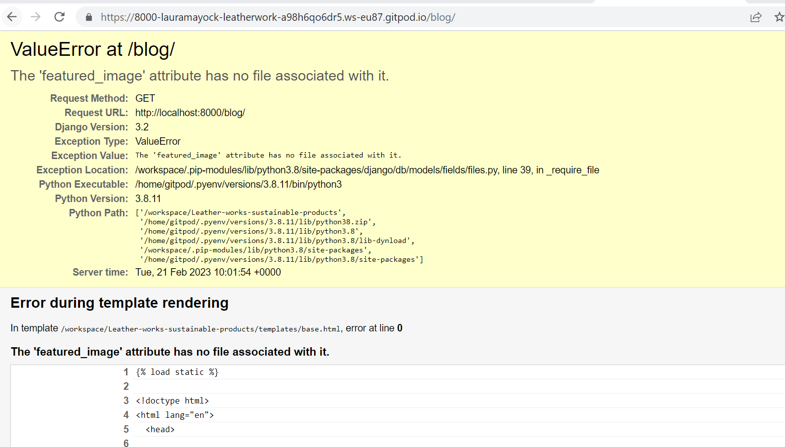
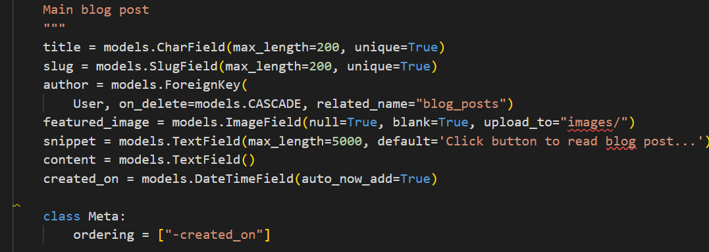

[Back to Readme](README.md)

    
<b>User Stories</b>

    

      The objective of this test is to validate that the user requirements have been delivered for the MVP release. Further details of the Epics, Features and User Story tasks can be found either in the [GitHub Projects Kanban Board](https://github.com/users/LauraMayock/projects/7).

| Ref  | User Story                                                                                                                                                                                                                                   | ACCEPTANCE CRITERIA                                                                                                                                                                                                                                                                                                                                                                                                                                                                      | RESULT       | RATIONALE                                                                                                                                                                                                                                                                                                                                                   |
|------|----------------------------------------------------------------------------------------------------------------------------------------------------------------------------------------------------------------------------------------------|------------------------------------------------------------------------------------------------------------------------------------------------------------------------------------------------------------------------------------------------------------------------------------------------------------------------------------------------------------------------------------------------------------------------------------------------------------------------------------------|--------------|-------------------------------------------------------------------------------------------------------------------------------------------------------------------------------------------------------------------------------------------------------------------------------------------------------------------------------------------------------------|
| US01 | As a Site User, I can understand what the site aim is and my options from viewing the homepage, so that I can intuitively navigate the site and have a good e-commerce experience                                                            | 1\. The site structure and layout should be clear and simple to navigate   2\. Site Users should be able to find products either from homepage adverts, Nav menu or Search function  3\. Site Users will have an option to register for a user account from the Navbar                                                                                                                                                                                                             | PASS         | Positive lighthouse accessibility ensures the website is of a high                                                                                                                                                                                                                                                                                          |
| US02 | As a Site User, I can use the Footer for navigation, so that I can learn more about the business                                                                                                                                             | 1\. Footer is located at the bottom of every page   2\. Footer provides links that are clear and accessible    3\. Links to social media are available                                                                                                                                                                                                                                                                                                                             | PASS         | There are links to company information within the footer. However from an accessibility perspective it is advised not to repeat menus within the same screen. As the navbar with links to company information is fixed to each page, only selective links have been added to the footer.                                                                    |
| US03 | As Site Owner, I want a brand logo, so Site Users can easily learn the type of products being sold                                                                                                                                           | 1\. A logo that is identifiable as relating to Leather Works products that will help build the brand   2\. Logo to be used within the Navbar and is always prominent.                                                                                                                                                                                                                                                                                                                 | PASS         | The company name is clear within the navbar and throughout the homepage.                                                                                                                                                                                                                                                                                    |
| US04 | As a Site Owner, I can add products to the site, so I can manage the content and adapt to changes in stock as lines become obsolete and new products come on board.                                                                          | 1\. Successfully add a product from either the back or front end    2\. Clear easy to use forms in both back and front end.  . Alerts, sucess messages and warning messages are there for safe guards and are prominent for the user.                                                                                                                                                                                                                                             | PASS         | A site owner can add new products either from a front end form when signed in, or from using the Django admin panel. This is safe guarded to only allow superusers this access.                                                                                                                                                                             |
| US05 | As a Site Owner, I can edit existing products on the site, so I can manage the content and adapt to changes in stock.                                                                                                                        | 1\. Successfully edit a product from either the back or front end    2\. Clear easy to use forms in both back and front end.   3\. Alerts, sucess messages and warning messages are there for safe guards and are prominent for the user.                                                                                                                                                                                                                                          | PASS         | A site owner can edit existing products either from a front end form when signed in, or from using the Django admin panel.                                                                                                                                                                                                                                  |
| US06 | As a Site Owner, I can remove products from the site, so I can manage the content and adapt to changes in stock                                                                                                                              | 1\. Successfully remove a product from either the back or front end   2\. Alerts, sucess messages and warning messages are there for safe guards and are prominent for the user.                                                                                                                                                                                                                                                                                                      | PASS         | A site owner can remove existing products either from a front end form when signed in, or from using the Django admin panel.                                                                                                                                                                                                                                |
| US07 | As a Shopper, i ca view individual products in detail so that I can make a more informed decision                                                                                                                                            | 1\. Sufficient details on the product category pages that offer Title, Subtitle, Price with a view to enticing the user to click and learn more2\. Product page with full descriptions in addition to those highlighted in products page.                                                                                                                                                                                                                                                | PASS         | Every product can be viewed in isolation complete with and description. Other key pieces of information are contained within the product details page such as color (if applicable) and price.                                                                                                                                                              |
| US08 | As a shopper, i can sort site items so that I can easily identify the best price/ product.                                                                                                                                                   | 1\. Category views that are accessible from the Navbar menu   2\. Category views that correctly dissect product lines                                                                                                                                                                                                                                                                                                                                                                 | PASS         | Drop-down menus from the fixed Navbar allow users to navigate to specific categories or see all products. This can also be done in the products page. where shoppers can also sort products.                                                                                                                                                                |
| US09 | As a Site Owner, I would like to use the homepage to promote items and key messages to users, so that I can drive traffic to the most beneficial areas | 1\. The revolving carousal has an hero image with a banner advertising a new line   | 2\. A button within the banner allows Site Users to be navigated to the latest product drip                                                                                                                                                                                                                                                                                                                                                                                              | PASS         | A carousal has been incorporated into the homepage and offers the ability to navigate users to specific pages.                                                                                                                                                                                                                                              |
| US10 | As a Site User, I can view recommendations from existing customers, as it will help to inform my trust in the business                                                                                                                       | 1\. A dedicated section of the homepage, where Site Users will see recommendations from existing customers                                                                                                                                                                                                                                                                                                                                                                               | PASS         | Product reviews are enabled for all products. To leave a review you must be registered and have verified the account through email confirmation.                                               |                                                                                                                                                            |
| US11 | As a Site User, I can learn more about the business, so that I can assess trustworthiness and ethos.                                                                                                                                         | 1\. A dedicated section of the homepage, where Site Users will learn more about the business, their ethos and the key people behind the business.                                                                                                                                                                                                                                                                                                                                        | PASS         | Users have access to the blog on the main nav bar and accesspoints through out the main paged that brings them to key infomation about the company and what they are doing for sustainability.                                                                                                                                                              |
| US12 | As a Site User, I would like to make a transaction without registering for a user account, as this is either a one off purchase or is my preference not to have a company hold my details                                                    | 1\. Not registered users can checkout without an account whilst still maintaining all checkout functionality                                                                                                                                                                                                                                                                                                                                                                             | PASS         | Site users can checkout without being a registered user.                                                                                                                                                                                                                                                                                                    |
| US13 | As a Site User, I would like my delivery details to be pre-populated when I come to pay, as this would be more convenient and ease my experience and time to purchase                                                                        | 1\. Pre-populated delivery details that can be overridden manually in the checkout area for authenticated users                                                                                                                                                                                                                                                                                                                                                                          | PASS         | Site users with a registered account will either have their delivery details stored following their first transaction, or can add them manually to their profile before a transaction.                                                                                                                                                                      |
| US14 | As a Site User, I would like to adjust the quantity or remove items from my shopping bag, in case I change my mind when assessing all my items before purchasing                                                                             | 1\. Site Users can increase or decrease the quantity of items within them shopping bag as part of the checkout process                                                                                                                                                                                                                                                                                                                                                                   | PASS         | Site users have the functionality to increase or decrease items within their bag before checking out. Users can also remove items completely.                                                                                                                                                                                                               |
| US15 | As a Site User, I can register an account, so that I can add reviews                                                                                                                                                                         | 1\. Site Users are provided with a simple Form to complete in order to register an account2\. Form fields should follow convention for sign-up forms3\. Form buttons should enable the Form to be submitted or reset if an error has been made                                                                                                                                                                                                                                           | PASS         | Users can sign-up for an account using a simple form and following instructions within to verify their account.                                                                                                                                                                                                                                             |
| US16 | As a Site User, I can sign-in to my account, so that I can utilise member benefits                                                                                                                                                           | 1\. Site Users will be able to sign-in from clicking a link in the Navbar menu2\. Sites Users will be required to enter their Username and Password to sign-in3\. A message should confirm to Site Users when they have successfully signed in4\. A message should inform Site Users if the information entered was not valid, and to try again                                                                                                                                          | PASS         | Site users can register for an account. Whilst for MVP the features are limited to storing default delivery details and viewing previous transactions, further benefits can be introduced for later releases as the foundations are built.                                                                                                                  |
| US17 | As a Site User, I can be asked to confirm my request to sign-out, so that I can cancel if requested in error                                                                                                                                 | 1\. Site Users will be able to sign-out from clicking a link in Navbar menu2\. A page will display asking Site Users to confirm they would like to proceed to sign-out, or continue using the site3\. If Site Users confirm they would like to sign-out they will be signed out and redirected to the home page4\. A message should confirm to Site Users when they have successfully signed out5\. If Site Users choose to continue using their account, access to features will remain | PASS         | Using the inbuilt functionality of Django, users are asked to confirm their request to sign-out.                                                                                                                                                                                                                                                            |
| US18 | As a Site User, I can view and change profile details, so that they are correct when I come to checkout                                                                                                                                      | 1\. Site Users can navigate to a restricted page that provides all the relevant profile details   2\. Site Users can amend any part of the information and save the changes3\. A success message will confirm the changes have been saved                                                                                                                                                                                                                                             | PASS         | Registered site users can edit their default delivery details within the profile area. A success message confirm the changes have been saved.                                                                                                                                                                                                               |
| US19 | As a Site User, I can add a product review, so that I can inform potential customers of what they might expect                                                                                                                               | 1\. Authenticated users will be able to post a review on a detailed product page | 2\. A button clearly stating to 'Submit' their review will be available3\. Site Users will be able to see their post instantly                                                                                                                                                                                                                                                                        | PASS         | Registered site users can add a product review directly to the website. Consideration was given to adding an approval step before publishing the comment, however to provide a positive user experience, I opted to publish the review straight away. These can be reviewed by the business owner and deleted from the Django admin area if deemed abusive. |
| US20 | As Site Owner, I would like Site Users to register for a monthly newsletter, so that I can build a relationship with customers and promote specific products                                                                                 | 1\. Site User can enter an email address and receive a success message within the browser2\. Site Users will receive confirmation of sign-up to their inbox                                                                                                                                                                                                                                                                                                                              | PASS         | Site users can subscribe to the newsletter using the Mailchimp feature on the homepage. Users do not have to register to subscribe and stay updated with products and news.                                                                                                                                                                                 |
| US21 | As Site Owner, I would like to provide Site Users with more information on the business, so that Site Users can understand the history, manufacturing process, company ethos etc. with a view to increasing trust and building relationships | 1\. Site Users will be able to access the blog from either the Footer or the main nav bar 2\. Site Users will be navigated to a new page which informs of who, when, why and what the business is about3\. Information about sustainable leather and the lengths Leather work gos to to produce sustainable leather products.                                                                                                                                                            | PASS         | There is a blog dedicated to learning about the business, their products and the importance of sustainable leather.                                                                                                                                                                                                                                         |
| US22 | As Site Owner, I can provide a contact form for Site Users, so they can provide feedback, request products, features etc.                                                                                                                    | 1\. Site Users will be able to access this page from the Footer2\. Site Users will be introduced to the FAQ page in case they hadn't already viewed this information and could of had their question answered3\. Site Users will be provided with a Form to complete, learning where the Form is sent and when to expect a response4\. Site Users will be redirected to the homepage when the form has been successfully submitted                                                       | PASS         | There is a contact form available for Site Users to send a query, concern or request to the business owners.Feedback is provided to the users to confirm the form has been sent successfully.                                                                                                                                                               |
| US23 | As a Site User, I can find answers to general questions, so that I don't have to wait for a response from the Site Owner                                                                                                                     | 1\. Site Users most popular questions can be answered in a single page that is conveniently accessed from the Footer2\. Site Users will be provided with a link to contact Site Admin if a question cannot be answered                                                                                                                                                                                                                                                                   | PASS         | The FAQ's provide a broad range of answers to typical questions. These can be added to by the developers as required. FAQ's can be navigated to from the Footer.                                                                                                                                                                                            |
| US24 | As a Site User, I can find out about sustainable leather and how the compancy unsure that their product are produced by sustainable leather |                                                                                                | 1\. Site Users will be able to learn about sustainable leather and the certification of sustainability that the company holds.                                                                                                                                                                                                                                                                                                                                                           | PASS         | Certification link in the footer and the sustainability link will divert users to a specific blog post dedicated to the subject.                                                                                                                                                                                                                            |
| US25 | As a Site User, I can access the site on differing devices, so I can interact with content on my preferred device                                                                                                                            | 1\. Successful tests for Responsiveness using Developer Tools2\. Successful tests for Responsiveness through manual testing on differing devices                                                                                                                                                                                                                                                                                                                                         | PASS         | Primarily using the Bootstrap framework the website is responsive across devices. This has been tested through a dedicated test for responsiveness.                                                                                                                                                                                                         |
| US26 | As a Site User, I can search for products by entering descriptive words, so that I can find what I want quickly                                                                                                                              | 1\. Search functionality is accessible from the Navbar2\. All keywords, names, descriptions return results                                                                                                                                                                                                                                                                                                                                                                               | PARTIAL PASS | Whilst the search functionality is operational, more than one search word produces zero results. This is being taken forward as a bug to fix.                                                                                                                                                                                                               |
                                                                                                     
                                     
 

 

## Validation

Page validation - check all features and links from across the site are working as designed and developed.

<b>Page Validation</b>

This test aims to check all features and links from across the site are working as designed and developed.

To perform the test I used a Chrome browser, and validated each page from a mobile and desktop perspective using the inbuilt developer tool as some features were unique to a particular screen size.

The results are largely positive with these two noticable fails.

   * Search bar - Searches will work when using only one word. When searching more then one word it comes up with 0 results.

   * Category Header - Category header in the products page shows clearly on the top left of the page but does not show if the Category All Products is chosen.

   * Update button in the checkout page will allow you to update a quantiy higher then 99.

   * Testimonial carousel left and right buttons arent working although it is working automatically.

   NB - With the below testing I noticed that the product image display wasnt working anymore. I realised taht i deleted the javascript code out of the quantity_input_scirpt.html page in order to create its own Javascript page. Due to time constraints I have decieded against this and will add it to future features.

| Features                      | Expectation                                                         | Links Active/Features (Desktop)              | Links Active/Features (Mobile)                |
|-------------------------------|---------------------------------------------------------------------|----------------------------------------------|-----------------------------------------------|
| Home Page                     |                                                                     |                                              |                                               |
| Navbar Logo Link              | Link to home page                                                   | Pass                                         | Pass                                          |
| Product Dropdown              | Links to all categories with header and product count visible       | Pass                                         | Pass                                          |
| Blog Dropdown                 | dropdown works                                                      | Pass                                         | Pass                                          |
| Super User                    | Link create blog                                                    | Pass                                         | Pass                                          |
| User                          | Link to blog only                                                   | Pass                                         | Pass                                          |
| Search bar                    | Button works and searches product name and description              | Bug: Shows no results for more than one word | Bug: Shows  no results for more then one word |
| My Account                    | dropdown                                                            | Pass                                         | Pass                                          |
| Not logged in                 | Access to Login/Register links                                      | Pass                                         | Pass                                          |
| Super User                    | Linls to Logout/MyAccount/Create Product                            | Pass                                         | Pass                                          |
| User                          | My account/logout                                                   | Pass                                         | Pass                                          |
| Shopping bag empty            | Link to page highlighting bag is empty                              | Pass                                         | Pass                                          |
| Carousel buttons left & right | when chicked buttons move carousel                                  | Pass                                         | Pass                                          |
| Sustainable leather button    | Link to relevant blog post                                          | Pass                                         | Pass                                          |
| Check out our products        | Link to products page                                               | Pass                                         | Pass                                          |
| Product category section      |                                                                     |                                              |                                               |
| Purse                         | Link to purse category with product count & heading visable         | Pass                                         | Pass                                          |
| Wallet                        | Link to Wallet category with product count & heading visable        | Pass                                         | Pass                                          |
| Satchels and Bags             | Link to Satchel&Bags category with product count & heading visable  | Pass                                         | Pass                                          |
| All Products                  | Link to All Products category with product count & heading visable  | Pass                                         | Pass                                          |
| Meet the Tanner section       | Link to blog post about the tanner                                  | Pass                                         | Pass                                          |
| Sustainable leather section   | Link to blog post about sustainable leather                         | Pass                                         | Pass                                          |
| Testimonials carousel         | moves automatically                                                 | Pass                                         | Pass                                          |
| Carousel buttons left & right | when chicked buttons move carousel                                  | Fail Known bug                               | Fail Known bug                                |
| Wholesale Section             |                                                                     |                                              |                                               |
| Email Link                    | link to gmail                                                       | Pass                                         | Pass                                          |
| Phone number                  | Link to make a call                                                 | Pass                                         | Pass                                          |
| Mail Chimp                    |                                                                     |                                              |                                               |
| Error message                 | Invalid email error message                                         | Pass                                         | Pass                                          |
| submit                        | Confirms subscription                                               | Pass                                         | Pass                                          |
| Footer                        |                                                                     |                                              |                                               |
| About us                      | Link to relevant blog post                                          | Pass                                         | Pass                                          |
| Sustainability                | Link to relevant blog post                                          | Pass                                         | Pass                                          |
| Certifications                | Link to relevant blog post                                          | Pass                                         | Pass                                          |
| FAQ                           | Link to relevant page                                               | Pass                                         | Pass                                          |
| Contact us                    | Link to relevant page                                               | Pass                                         | Pass                                          |
| Social medial links           |                                                                     |                                              |                                               |
| Facebook                      | Link to Facebook site                                               | Pass                                         | Pass                                          |
| Instagram                     | Link to Instagram                                                   | Pass                                         | Pass                                          |
| twitter                       | Link to Twitter                                                     | Pass                                         | Pass                                          |
| Linkedin                      | Link to Linked in                                                   | Pass                                         | Pass                                          |
| Products page                 |                                                                     |                                              |                                               |
| Categories dropdown           | Links to page chosen category                                       | Pass                                         | Pass                                          |
| Category result header        | Header shows which category has been chosen                         | No header for All Products                   | No header for All Products                    |
| All Products button           | Link showing all products                                           | Pass                                         | Pass                                          |
| Product count                 | Show total product found per category/search                        | Pass                                         | Pass                                          |
| Sort By Bar                   | Sorts product py chosen sort                                        | Pass                                         | Pass                                          |
| Link to Product details page  | Click on product to bring you to product details page               | Pass                                         | Pass                                          |
| Super user buttons            | Buttons available specifically for super users                      | Pass                                         | Pass                                          |
| Edit button                   | Link to edit product form                                           | Pass                                         | Pass                                          |
| Delete Button                 | Link to delete the product confirmation page                        | Pass                                         | Pass                                          |
| Product Details Page          |                                                                     |                                              |                                               |
| Product display               | Click on smaller images to show them as the large image.            | Fail (Future Feature)                        | Fail (Future Feature)                         |
| Color option                  | Color option only when relevant                                     | Pass                                         | Pass                                          |
|                               | dropdown working and choice being added to basket                   | Pass                                         | Pass                                          |
| Quantity                      | wont go lower then 1 or higher then pp                              | Pass                                         | Pass                                          |
| Keep shopping                 | reverts back to product page                                        | Pass                                         | Pass                                          |
| Add item                      | Adds item to basket                                                 | Pass                                         | Pass                                          |
| Super User                    |                                                                     | Pass                                         | Pass                                          |
| Edit button                   | Goes to relevant page only accessible to superuser                  | Pass                                         | Pass                                          |
| Delete button                 | Goes to relevant page only accessible to superuser                  | Pass                                         | Pass                                          |
| Cutomer reviews               | Visable to all                                                      | Pass                                         | Pass                                          |
|                               | Can only add a review if logged in                                  | Pass                                         | Pass                                          |
|                               | Review posting is instant                                           | Pass                                         | Pass                                          |
|                               | User name is posted automatically                                   | Pass                                         | Pass                                          |
|                               | Date and time added automatically                                   | Pass                                         | Pass                                          |
| Shopping Bag                  |                                                                     | Pass                                         | Pass                                          |
| Bag total                     | Total showing and accurate                                          | Pass                                         | Pass                                          |
| Delivery cost                 | Delivery cost accurate or free over $50                             | Pass                                         | Pass                                          |
| Keep shopping button          | link to products page                                               | Pass                                         | Pass                                          |
| secure checkout button        |                                                                     | Pass                                         | Pass                                          |
| update button                 | Add total requested                                                 | Updates when amount more then 99             | Updates when amount more then 99              |
| remove button                 | removes product                                                     | Pass                                         | Pass                                          |
| reduce quantity button        | reduces quantity wont allow anything below 0                        | Pass                                         | Pass                                          |
| add on quantity button        | will not go highter then 99 but you can type in number higher       | Pass                                         | Pass                                          |
| color description             | shows color chosen                                                  | Pass                                         | Pass                                          |
| Secure checkout page          |                                                                     |                                              |                                               |
| Subtotal                      | calcuted correctly                                                  | Pass                                         | Pass                                          |
| total                         | total calculated correctly                                          | Pass                                         | Pass                                          |
| delivery cost                 | delivery total                                                      | Pass                                         | Pass                                          |
| form validation               | Error messages and alerts will show                                 | Pass                                         | Pass                                          |
| spinner                       | when order is being submitted spinner apears                        | Pass                                         | Pass                                          |
| Success alert                 | Alert confirming order and order number                             | Pass                                         | Pass                                          |
| Confirmation page             | Full details of order and confirmation page appears after submit    | Pass                                         | Pass                                          |
| save deliver info tick box    | when box is ticked it saves info to profile                         | Pass                                         | Pass                                          |
|                               | Whenk box is unticked info is not saved.                            | Pass                                         | Pass                                          |
| Blog                          |                                                                     |                                              |                                               |
| Read More button              | Button takes you to full blog post                                  | Pass                                         | Pass                                          |
| In blog links                 | All links in post go to relevant pages                              | Pass                                         | Pass                                          |
|                               |                                                                     | Pass                                         | Pass                                          |
| Create Post page              | /blog/add_post/                                                     | Pass                                         | Pass                                          |
| Form vaildation               | Shows errors if not filled out correctly                            | Pass                                         | Pass                                          |
| Success alert                 | Shows success message when posted                                   | Pass                                         | Pass                                          |
|                               |                                                                     |                                              |                                               |
| Login button                  | takes you to relevant page                                          | Pass                                         | Pass                                          |
|                               | form validation                                                     | Pass                                         | Pass                                          |
|                               | Success alert when signed in                                        | Pass                                         | Pass                                          |
|                               | sign up button diverts to correct page                              | Pass                                         | Pass                                          |
| logout button                 | takes you to relevant page                                          | Pass                                         | Pass                                          |
|                               | form validation                                                     | Pass                                         | Pass                                          |
|                               | Success alert when signed in                                        | Pass                                         | Pass                                          |
|                               | sign up button diverts to correct page                              | Pass                                         | Pass                                          |
| Sign up button                | takes you to relevant page                                          | Pass                                         | Pass                                          |
|                               | form validation                                                     | Pass                                         | Pass                                          |
|                               | Success alert when signed in                                        | Pass                                         | Pass                                          |
|                               | sign up button diverts to correct page                              | Pass                                         | Pass                                          |
| My Profile                    | Info is updated when requested                                      | Pass                                         | Pass                                          |
|                               | Order history is showing                                            | Pass                                         | Pass                                          |
| Order Number links            | Links to confirmaiton page with all relevant info                   | Pass                                         | Pass                                          |

<b>Responsiveness </b>

To test the websites layout and content remains well structured and accessible across differing screen sizes, I used Chrome's Developer Tools to virtualise how the website and all it's pages look and feel. In consideration that I opted to use Bootstrap which provides standard media queries for screen sizes from XS through to XL, I selected the following screens to test on; iPhone SE, Samsung Galaxy S8, Surface Pro, Nest hub Max, Laptop L -1440px.

* Given more time, I would like to amend the Hamburger to kick in a smaller screen. At the moment, it is kicking in at 991.98px. Showing the logo on table-size screens would be more beneficial for the business for logo recognition.

| Page                               | Mobile | Tablet  | Desktop |
|------------------------------------|--------|---------|---------|
| Home Page                          | PASS   | PASS    | PASS    |
| /products/                         | PASS   | PASS    | PASS    |
| /products/1/                       | PASS   | PASS    | PASS    |
| /accounts/signup/                  | PASS   | PASS    | PASS    |
| /accounts/login/                   | PASS   | PASS    | PASS    |
| /accounts/password/reset/          | PASS   | PASS    | PASS    |
| /products/add                      | PASS   | PASS    | PASS    |
| /bag/                              | PASS   | PASS    | PASS    |
| /profile/                          | PASS   | PASS    | PASS    |
| /profile/order_history/            | PASS   | PASS    | PASS    |
| /blog/                             | PASS   | PASS    | PASS    |
| /blog/We-are-cetfified/            | PASS   | PASS    | PASS    |
| /blog/what_is_sustainable_leather/ | PASS   | PASS    | PASS    |
| /blog/meet-the-chief-tanner/       | PASS   | PASS    | PASS    |
| /blog/faqs                         | PASS   | PASS    | PASS    |
| /blog/contact                      | PASS   | PASS    | PASS    |
| /blog/bespoke-made-to-order/       | PASS   | PASS    | PASS    |
| /checkout/checkout_success.html    | PASS   | PASS    | PASS    |
| /products/delete/                  | PASS   | PASS    | PASS    |
| /products/edit/                    | PASS   | PASS    | PASS    |

<b>Accessibility</b>

Key to any successful eCommerce website is ensuring its accessibility. Whilst in the design phase I consulted colour contrasting checkers to test for accessibility but overlooked image sizing. Origionally I had images in the categories section. But they required <scrset></scrset> to be used to ensure images were resized accurately. Due to timing constraintes i decided to remove the images and add to future features. 

#### Origional category section 
[Origional section](media/Screenshot_20230301_222903.png)

#### Updated section
[Section now](media/Products-range.png)

### Origional lighthouse testing
[Origional lighthouse test](media/main%20desktop%20lighthouse.png)

<b>Lighthouse Scores</b>

# Home Page

## Desktop 

## Mobile

# Product page

## Desktop

## Mobile

# shopping bag

## Desktop

## Mobile

# Checkout page

## Desktop

## Mobile

# Checkout success page

## Desktop

## Mobile

# My profile

## Desktop

## Mobile

### Reviewing the Lighthouse Scores

The performance score was generally a little lower on mobiles however testing from several mobile devices the site was responsive and responded well.

I also note that lighthouse highlighted "Eliminate render-blocking resources" as its top opportunity to save on loading time. The urls highlighted where strip, mailchimp, jquery, bootstrap that where loaded on the base page. This was done purposefully at the time to ensure security with strip and consistency on all pages with bootstrap.

<b>Code Validation </b>

Writing well formed, quality code is essential for the future development of this, or any website. To support this aim I have used industry standard tools [list below] to validate every line of code using the input method. As well as using this tools, using GitPod as IDE allowed me to utilise the inbuilt code checkers such as Pycodestyle for Python.

W3 Validator for HTML
W3 Jigsaw for CSS
JS Hint for JavaScript
CI Python Linter for Python

Most errors were easily amended. I had significant issies with the way I originally chose to set up my navbar. "li not allowed to be a child of a nav element, span or div not allowed to be an element of a ul. This gave me quite a bit of trouble. Although I fixed the issue in the end I learned I need to spend more time understanding basic HTML validation in relation to Navbars. 

Another error was the type element in the <script> which was unneeded and could be deleted.

# Bugs

Below is a list of bugs and fixes found while creating a feature.

<b>ERROR 500 page when purchasing</b>

Cause - This was caused by an unknown blank space placed after the AWS secret key in the workspace variables section. When debug was changed to true the below error showed.

I origionally checked the webhooks to ensure I didnt to an error when tidying up the code and then checked the webhooks were connecting to the strip account. Which they were.

<b>Images in product details page.</b>

Issue and cause - As you click on the small images they should replace the large image. This kept breaking mainly due to me becoming complacent as deadline approached. 

Fix - I learned a great leason in the end that I know will carry me through my career going forward. In the GitHub repository you can click the history icon that will show up the last commits. I retreived deleted code from here.

<b>NoReverseMatch at /blog</b>

Cause - blog post id called incorrectly.

Blog error fixed. Typo origionally at post.id.

<b>ValueError at /blog/</b>

Issue - When trying up upload images frontend for the blog the below error would appear.

[Tutorial on how to upload images front end.](https://www.youtube.com/watch?v=ygzGr51dbsY)

Fix - In the model I outlined where images should be loaded to.

<b>Hamburger not working on medium-size screens.</b>

Cause - I think what was happening is that the hamburger was kicking in but the large screen wasnt being hidden correctly.

Fix - amend the highlighted part in the image from d-md-none to d-lg-none

<b>Django summer note not showing text correctly</b>

Cause - needed to add in  | safe after calling the content.

<b>Shopping bag stopped being responsive</b>

Issue- On small screen shopping bag was showing correctly. On larger screen it was showing a blank page but the header.

Cause - Refactored code wasnt pulling through die to error in the file path.

<b>Edit page not scrolling and positioned to the bottom right of screen</b>

Cause - In further investigations it seems that a toast message in the view.py file that alerts customers what product they are editing is causing the issue.

Fix- I decided that as they edit form shows all the product information for the user there is no real need to show a toast alert in this instance so i have removed it. This has fixed the issue.

[Back to top](<#top>)

[Back to Readme](README.md)